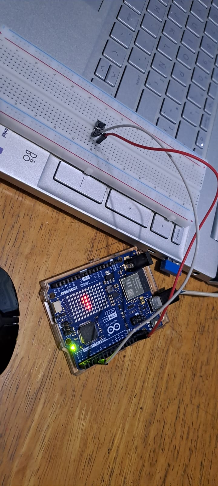

# Buffer circular con interrupción externa

Arduino Uno R4 WiFi · Matriz LED integrada · Pulsador en pin de interrupción (D2)

## Descripción

El proyecto simula el sensor de piezas de una banda transportadora: cada vez que se presiona el pulsador, el Arduino debe registrar ese evento sin perderlo, aunque en ese momento esté ocupado dibujando una animación en su matriz de LEDs. El pulsador se conecta a un pin capaz de generar una **interrupción externa**, así que en vez de tener que revisarlo constantemente en el `loop()`, le avisa al Arduino de inmediato en el instante en que se presiona, sin importar qué parte del código esté ejecutando. Para no perder eventos ni bloquear el programa, cada aviso se guarda temporalmente en un **buffer circular** de tamaño fijo (32 posiciones): la interrupción solo anota el instante del evento y sale, mientras que el `loop()` los va leyendo y procesando a su propio ritmo, sin dejar de animar la matriz LED.

## Objetivos de aprendizaje

- Configurar una interrupción externa (modo `FALLING`) en un pin del Arduino para reaccionar a un evento impredecible sin tener que revisarlo constantemente desde el `loop()`.
- Implementar un buffer circular de tamaño fijo para guardar eventos generados por la interrupción sin perder ninguno, usando índices de escritura y lectura independientes.
- Distinguir el estado "buffer lleno" del estado "buffer vacío" cuando ambos índices podrían apuntar al mismo lugar.
- Aplicar un filtro de antirrebote (40 ms) dentro de la propia rutina de interrupción, en vez de dentro del `loop()`.
- Mantener una animación no bloqueante en la matriz LED con `millis()` mientras se atienden los eventos registrados por la interrupción.

## Material utilizado

- Arduino Uno R4 WiFi (con matriz LED integrada)
- Pulsador de cuatro patas
- Protoboard
- 2 cables de conexión
- Cable USB-C

## Diagrama del circuito

 

## Código
Implementa un arreglo circular de 32 posiciones alimentado por
una interrupción externa en el pin D2:
[Buffer_Circular1.ino](Codigo/Buffer_Circular1.ino)

## Video del funcionamiento
Muestra el pulsador conectado al pin D2 y la matriz LED en movimiento durante toda la
prueba, mientras se presiona el botón repetidamente y se registran los eventos en el monitor
serie sin que la animación se detenga.
[Ver video en YouTube](https://youtu.be/Lg2vXyP2IQk)

## Resultados

Las pruebas se realizaron el 15 de septiembre de 2026, registrando 30 eventos consecutivos al
presionar el pulsador (pin D2) mientras la matriz LED ejecutaba su animación.

- Los 30 tiempos registrados son estrictamente crecientes: el buffer respetó siempre el orden
  de llegada, sin repeticiones ni saltos.
- El intervalo más corto entre eventos fue de **67.595 ms** (mayor al umbral de 40 ms del
  antirrebote) y el más largo, **13.370827 s** (entre los eventos #24 y #25).
- No se observó ningún mensaje de "buffer lleno" en las 30 pulsaciones registradas.
- La animación de la matriz LED se mantuvo en movimiento durante toda la prueba, confirmando
  que la interrupción no bloqueó el resto del programa.
  
## Reporte

Reporte formal con introducción, metodologia utilizada, capturas de la web funcionando, análisis de resultados y conclusiones individuales.
Incluye: [Reporte_buffercircular.pdf](Reporte/Reporte_buffercircular.pdf). 

## Conclusiones

La práctica permitió registrar eventos impredecibles sin perder ninguno, combinando una interrupción externa (pin D2, modo `FALLING`) con un buffer circular de 32 posiciones. La interrupción se limitó a anotar el instante de cada pulsación y salir de inmediato, mientras que el `loop()` procesó esos datos a su propio ritmo y mantuvo la animación de la matriz LED en movimiento constante, sin usar `delay()` en ningún punto del programa. El filtro de antirrebote (40 ms) dentro de la propia interrupción evitó que un solo clic físico se registrara como varias pulsaciones, y la variable `eventosPendientes` resolvió la ambigüedad entre el buffer lleno y el vacío cuando ambos índices podrían coincidir. Las pruebas confirmaron el orden y la integridad de los 30 eventos registrados, aunque quedó pendiente demostrar la vuelta completa del buffer y su respuesta al llenarse, algo que requeriría una prueba con más de 32 pulsaciones.

