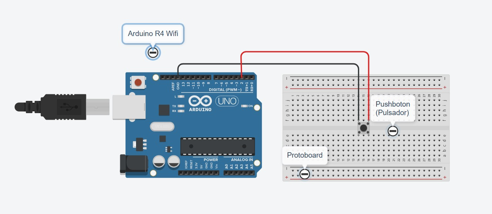
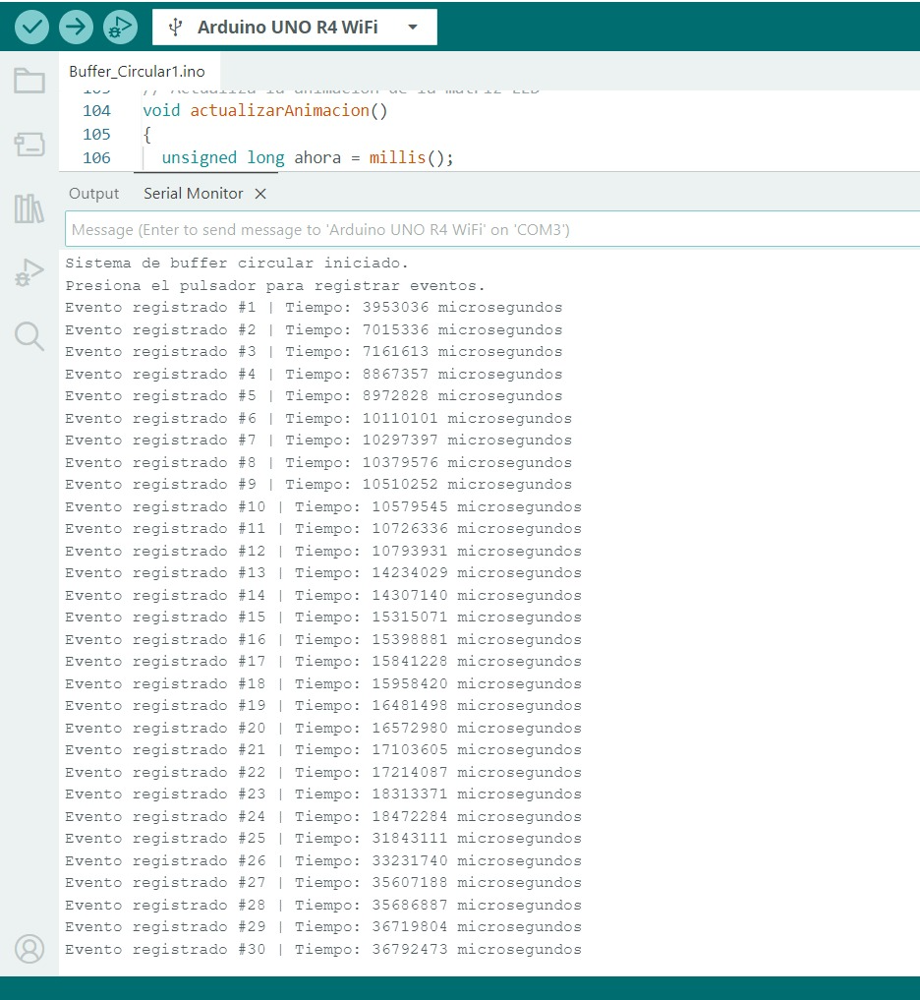
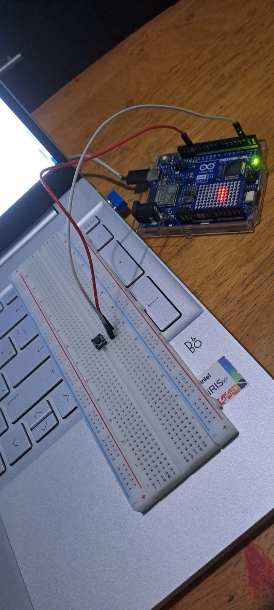

# Buffer circular con interrupción externa

Arduino Uno R4 WiFi · Matriz LED integrada · Pulsador en pin de interrupción (D2)

## Descripción

El proyecto simula el sensor de piezas de una banda transportadora: cada vez que se presiona el pulsador, el Arduino debe registrar ese evento sin perderlo, aunque en ese momento esté ocupado dibujando una animación en su matriz de LEDs. El pulsador se conecta a un pin capaz de generar una **interrupción externa**, así que en vez de tener que revisarlo constantemente en el `loop()`, le avisa al Arduino de inmediato en el instante en que se presiona, sin importar qué parte del código esté ejecutando. Para no perder eventos ni bloquear el programa, cada aviso se guarda temporalmente en un **buffer circular** de tamaño fijo (32 posiciones): la interrupción solo anota el instante del evento y sale, mientras que el `loop()` los va leyendo y procesando a su propio ritmo, sin dejar de animar la matriz LED.

## Objetivos de aprendizaje

- Configurar una interrupción externa (modo `FALLING`) en un pin del Arduino para reaccionar a un evento impredecible sin tener que revisarlo constantemente desde el `loop()`.
- Implementar un buffer circular de tamaño fijo para guardar eventos generados por la interrupción sin perder ninguno, usando índices de escritura y lectura independientes.
- Distinguir el estado "buffer lleno" del estado "buffer vacío" cuando ambos índices podrían apuntar al mismo lugar.
- Aplicar un filtro de antirrebote (40 ms) dentro de la propia rutina de interrupción, en vez de dentro del `loop()`.
- Mantener una animación no bloqueante en la matriz LED con `millis()` mientras se atienden los eventos registrados por la interrupción.

## Material utilizado

- Arduino Uno R4 WiFi (con matriz LED integrada)
- Pulsador de cuatro patas
- Protoboard
- 2 cables de conexión
- Cable USB-C

## Diagrama del circuito



### Conexiones

| Elemento | Pin del Arduino | Función |
|---|---|---|
| Pulsador | Pin 2 (D2, `INPUT_PULLUP`, interrupción `FALLING`) | Genera el aviso de una pulsación; simula el sensor de piezas |
| Matriz LED | Integrada en la placa | Muestra una animación en movimiento que nunca se detiene |

### Función de cada componente

- **Arduino Uno R4 WiFi:** ejecuta la interrupción, administra el buffer circular y controla la animación de la matriz LED.
- **Pulsador:** hace el papel del sensor de piezas de una banda transportadora; genera el evento que se debe registrar sin perderlo.
- **Matriz LED integrada:** mantiene una animación en movimiento constante, incluso mientras ocurre la interrupción.
- **Protoboard y cables:** permiten montar el pulsador entre el pin D2 y GND sin soldar los componentes.

## Código

[Buffer_Circular1.ino](Codigo/Buffer_Circular1.ino)

### La interrupción (ISR) y el filtro de rebote

La función `registrarEvento()` se ejecuta cada vez que el pin D2 cambia de HIGH a LOW (interrupción `FALLING`). Dentro de ella se consulta `micros()`, se aplica un filtro de 40 ms para ignorar los rebotes eléctricos del pulsador, y si hay espacio libre en el buffer se guarda el instante del evento, avanzando el índice de escritura. La función no imprime nada por pantalla ni hace cálculos: solo anota el dato y sale de inmediato, para que el resto del programa quede pausado el menor tiempo posible.

### El buffer circular

El buffer tiene 32 posiciones. `indiceEscritura` e `indiceLectura` indican dónde guardar y de dónde retirar el siguiente evento; al llegar a 31 regresan a 0. La variable `eventosPendientes` distingue el estado vacío (0) del lleno (32), ya que en ambos casos los dos índices podrían coincidir.

### Lectura en el `loop()`

`obtenerEvento()` retira un evento por vuelta del `loop()`, protegiendo brevemente las variables compartidas con la interrupción, e incrementa el contador que se imprime por el Monitor Serial.

### Animación de la matriz LED

`actualizarAnimacion()` desplaza una línea de LEDs en la matriz integrada cada 100 ms usando `millis()`, sin usar `delay()` en ningún momento, para que la animación nunca se detenga aunque el pulsador se presione repetidamente.

## Terminal



Captura del Monitor Serial mostrando el registro consecutivo de 30 eventos (del #1 al #30), cada uno con su tiempo en microsegundos desde el arranque.

## Video del funcionamiento

[Ver video en YouTube](https://youtu.be/Lg2vXyP2IQk)

## Evidencias de armado

 

## Resultados

Incluye: [Resultados_buffercircular.pdf](Resultados/Resultados_buffercircular.pdf). Contiene las gráficas del conteo acumulado y del intervalo entre los 30 eventos registrados, las tablas de indicadores calculados y de los primeros diez eventos, y las observaciones sobre el comportamiento del sistema.

## Conclusiones

La práctica permitió registrar eventos impredecibles sin perder ninguno, combinando una interrupción externa (pin D2, modo `FALLING`) con un buffer circular de 32 posiciones. La interrupción se limitó a anotar el instante de cada pulsación y salir de inmediato, mientras que el `loop()` procesó esos datos a su propio ritmo y mantuvo la animación de la matriz LED en movimiento constante, sin usar `delay()` en ningún punto del programa. El filtro de antirrebote (40 ms) dentro de la propia interrupción evitó que un solo clic físico se registrara como varias pulsaciones, y la variable `eventosPendientes` resolvió la ambigüedad entre el buffer lleno y el vacío cuando ambos índices podrían coincidir. Las pruebas confirmaron el orden y la integridad de los 30 eventos registrados, aunque quedó pendiente demostrar la vuelta completa del buffer y su respuesta al llenarse, algo que requeriría una prueba con más de 32 pulsaciones.

## Reporte

Incluye: [Reporte_buffercircular.pdf](Reporte/Reporte_buffercircular.pdf). Reporte completo de la práctica: introducción, objetivos, marco teórico, materiales, desarrollo, resultados, análisis y conclusiones (general e individual).

## Estructura de carpetas

```
BufferCircular/
├── README.md
├── Codigo/
│   └── Buffer_Circular1.ino
├── Diagrama/                 ← esquemático (Tinkercad)
├── Imagenes/                 ← fotos del armado
├── Terminal/                 ← captura del monitor serie
├── Resultados/                ← gráficas y tablas de los eventos registrados
├── Reporte/                   ← reporte de la práctica
└── Video/                     ← enlace al video
```
