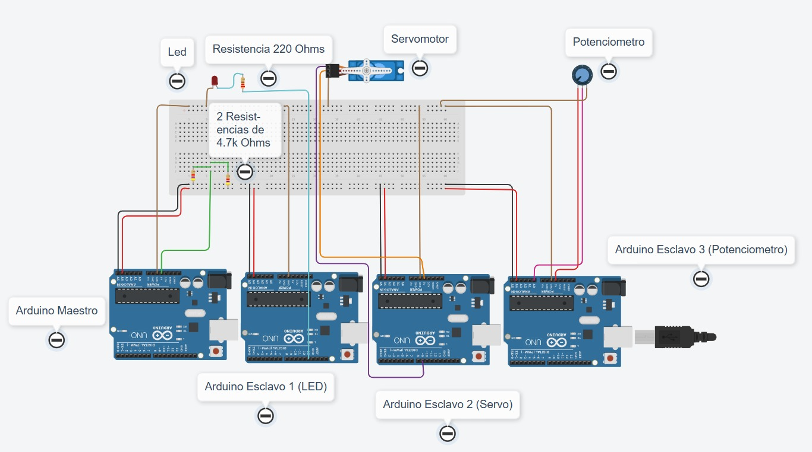
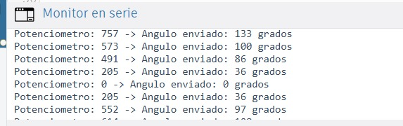
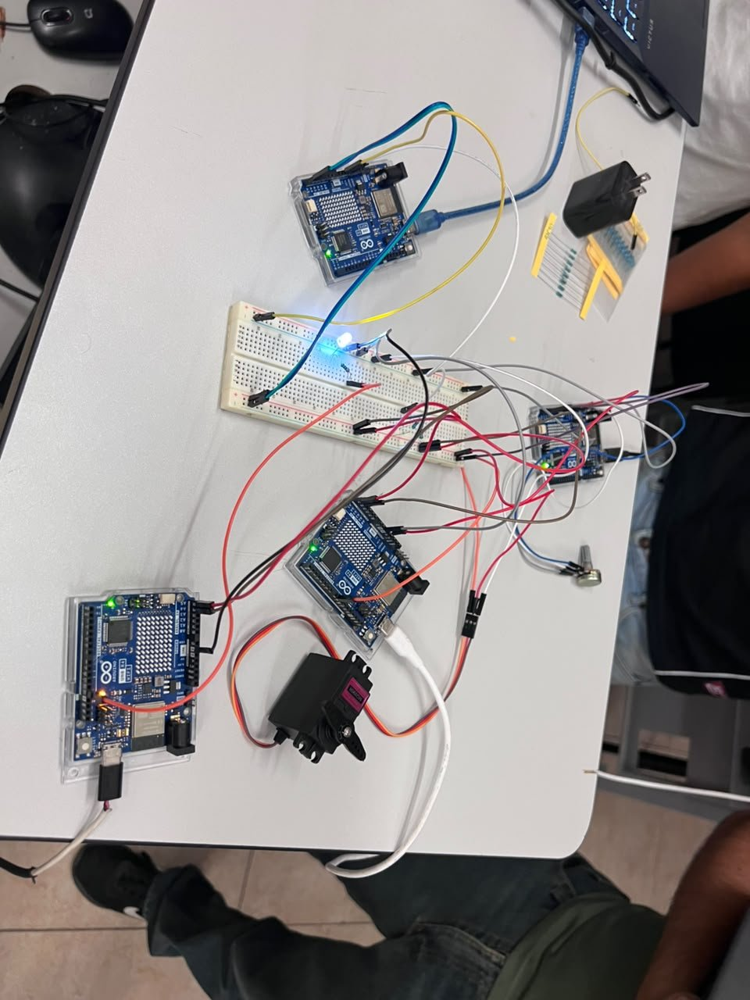
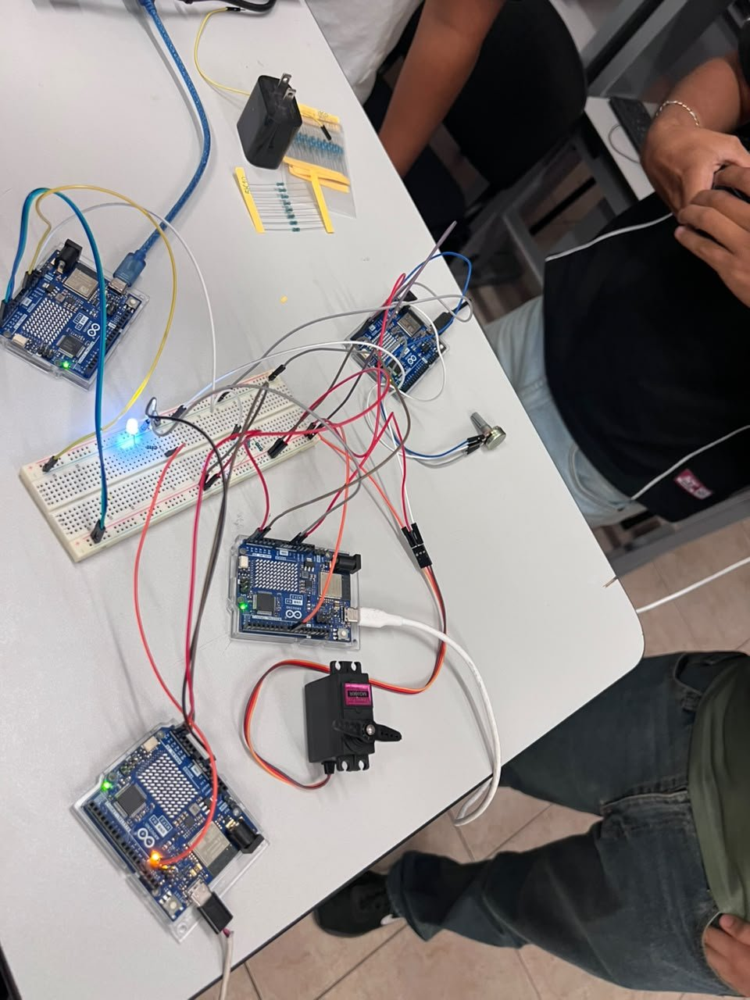

# Comunicación I2C entre 4 Arduinos

4 Arduino UNO R4 WiFi · Bus I2C (SDA/SCL) · LED · Servomotor · Potenciómetro

## Descripción

Se arma un bus I2C con cuatro Arduinos: un **maestro** y tres **esclavos** que comparten las líneas SDA y SCL, con tierra (GND) común entre todos. Cada esclavo se identifica con una dirección distinta:

- **Esclavo 1 (0x08):** recibe una orden del maestro y enciende o apaga un LED.
- **Esclavo 2 (0x09):** recibe un ángulo del maestro y mueve un servomotor.
- **Esclavo 3 (0x0A):** lee un potenciómetro y envía su valor al maestro cuando este se lo pide.

Cada 500 ms el maestro pide el valor del potenciómetro al esclavo 3, lo convierte a un ángulo de 0° a 180° y se lo manda al esclavo 2. Además, desde el Monitor serie se puede escribir `1` o `0` para encender o apagar el LED del esclavo 1. El maestro muestra en el Monitor serie el valor leído y avisa si algún esclavo no responde.

## Objetivos de aprendizaje

- Comprender el funcionamiento del bus I2C y el papel del maestro y de los esclavos.
- Asignar una dirección única a cada esclavo con `Wire.begin(direccion)`.
- Enviar datos del maestro al esclavo (`beginTransmission()` / `write()` / `endTransmission()`) y pedir datos al esclavo (`requestFrom()` / `onRequest()`).
- Mandar un valor de 10 bits (0–1023) en dos bytes con `highByte()` y `lowByte()` y reconstruirlo en el maestro.
- Detectar cuando un esclavo no contesta (NACK) revisando el resultado de `endTransmission()`.
- Usar `millis()` en lugar de `delay()` para que el maestro no se bloquee.

## Material utilizado

- 4 Arduino UNO R4 WiFi
- 1 protoboard
- 1 LED
- 1 resistencia de 220 Ω (470 Ω en el R4 WiFi físico)
- 1 servomotor
- 1 potenciómetro
- 2 resistencias de 4.7 kΩ (pull-up en SDA y SCL)
- Cables de conexión
- Cables USB (uno por placa)

Software: librerías `Wire` y `Servo` (incluidas en el entorno de Arduino), Monitor serie y Tinkercad Circuits.

## Diagrama del circuito

<table>
  <tr>
    <td></td>
    <td></td>
  </tr>
  <tr>
    <td align="center"></td>
    <td align="center"></td>
  </tr>
</table>

Arriba: diagrama en Tinkercad y terminal (Monitor serie) del maestro. Abajo: armado físico con los 4 Arduino UNO R4 WiFi.

### Conexiones

| Señal | Maestro | Esclavo 1 (LED) | Esclavo 2 (Servo) | Esclavo 3 (Pot.) |
|-------|---------|-----------------|-------------------|------------------|
| SDA   | SDA     | SDA             | SDA               | SDA              |
| SCL   | SCL     | SCL             | SCL               | SCL              |
| GND   | GND     | GND             | GND               | GND              |
| Periférico | — | LED en pin 13 (con resistencia) | Señal del servo en pin 9 | Cursor del potenciómetro en A0 |

## Código

Cada Arduino necesita su propio programa:

- [Maestro.ino](Codigo/Maestro/Maestro.ino): maestro del bus (versión para R4 WiFi, espera a que se abra el puerto USB).
- [Esclavo1_LED.ino](Codigo/Esclavo1_LED/Esclavo1_LED.ino): esclavo 0x08, controla el LED.
- [Esclavo2_Servo.ino](Codigo/Esclavo2_Servo/Esclavo2_Servo.ino): esclavo 0x09, mueve el servomotor.
- [Esclavo3_Potenciometro.ino](Codigo/Esclavo3_Potenciometro/Esclavo3_Potenciometro.ino): esclavo 0x0A, envía la lectura del potenciómetro.

## Video del funcionamiento

Se muestra el bus I2C funcionando con los 4 Arduino UNO R4 WiFi: al girar el potenciómetro el servomotor cambia de posición y el LED se enciende o apaga desde el Monitor serie.
- [Readme](Video/Readme.txt)
- [Ver video en YouTube](https://youtu.be/rPVRqIlCSFY)

## Resultados

En el Monitor serie del maestro se observó cada lectura del potenciómetro junto con el ángulo enviado al servo, por ejemplo:

```
Potenciometro: 757 -> Angulo enviado: 133 grados
Potenciometro: 573 -> Angulo enviado: 100 grados
Potenciometro: 491 -> Angulo enviado: 86 grados
Potenciometro: 205 -> Angulo enviado: 36 grados
Potenciometro: 0 -> Angulo enviado: 0 grados
```

- Los ángulos corresponden a la conversión `map(valor, 0, 1023, 0, 180)`: por ejemplo, 757 × 180 / 1023 ≈ 133°.
- El servomotor siguió el movimiento del potenciómetro con una actualización cada 500 ms.
- El LED del esclavo 1 respondió a las órdenes `1` y `0` escritas en el Monitor serie, sin interrumpir las lecturas del potenciómetro.
- No aparecieron mensajes de "no responde", lo que confirma que los tres esclavos contestaron en sus direcciones.

## Reporte

Reporte formal con introducción, metodologia utilizada, capturas del monitor serie y del armado, análisis de resultados y conclusiones individuales.
[Reporte_Comunicacion_I2C.pdf](Reporte/Reporte_Comunicacion_I2C.pdf)

## Conclusiones

El bus I2C permite comunicar varios dispositivos usando solo dos líneas (SDA y SCL) más tierra común; agregar un esclavo no requiere pines adicionales, solo una dirección diferente, y cada dirección debe ser única para que los datos no se corrompan. El maestro controla toda la comunicación: decide con quién habla, cuándo y si pide o manda datos, mientras que el esclavo solo responde cuando se le llama. Revisar el resultado de `endTransmission()` permitió detectar cuando un esclavo no contesta en lugar de que el sistema se congelara, y usar `millis()` en el maestro le permitió atender el Monitor serie y consultar el potenciómetro sin bloquearse. Durante la práctica se identificaron dos errores frecuentes: colocar ambas patas de la resistencia en la misma columna de la protoboard (el LED queda sin resistencia y se quema) y leer varias veces el mismo dato de I2C dentro de una expresión (se consume en la primera lectura). Con el R4 WiFi además fue necesario esperar a que abra el puerto USB, usar una resistencia mayor para el LED, agregar las pull-ups de 4.7 kΩ y unir solo los GND de las placas, alimentando cada una por su propio USB.
