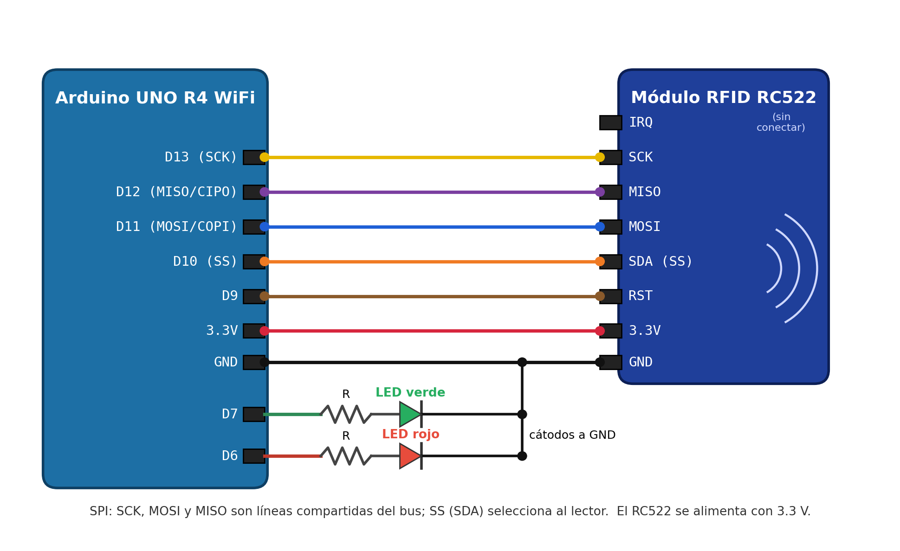
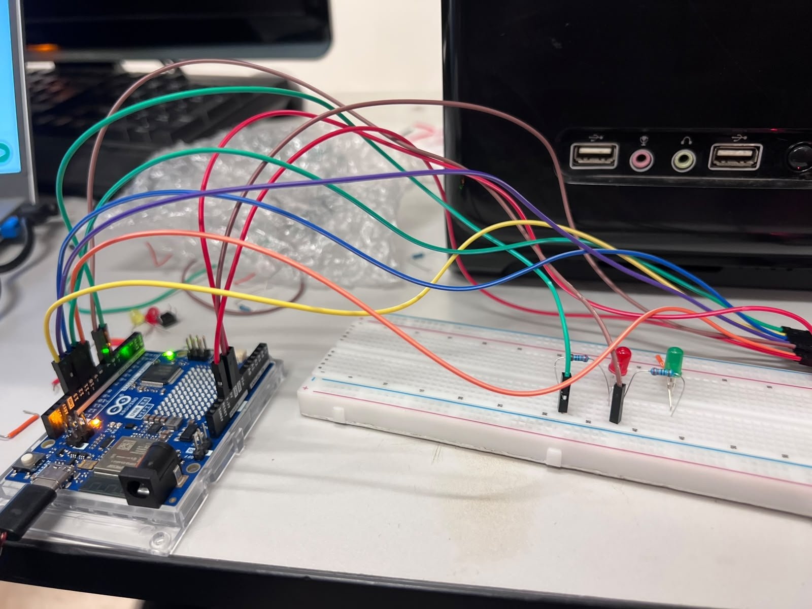
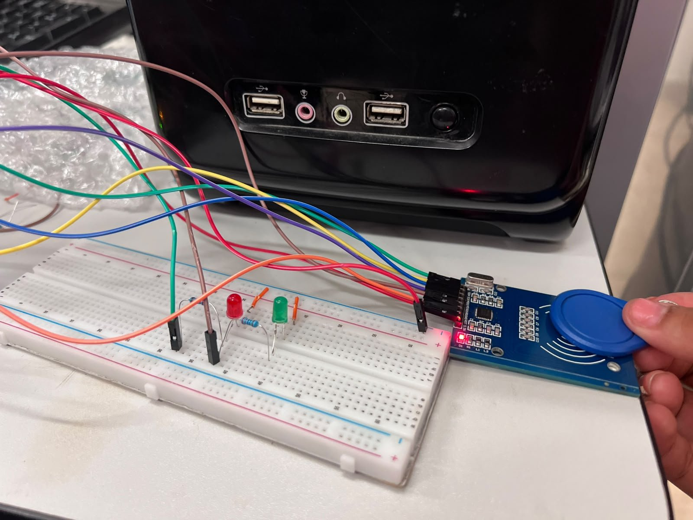
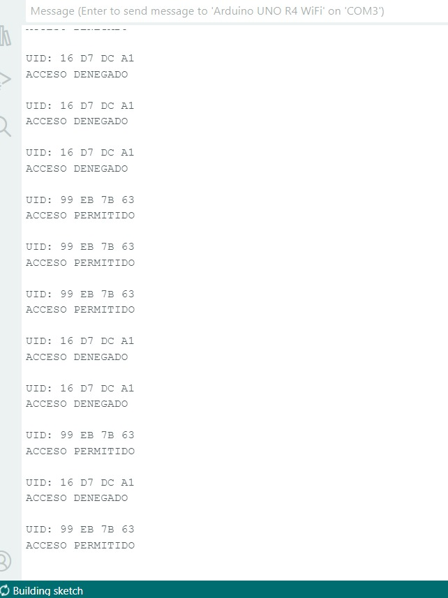
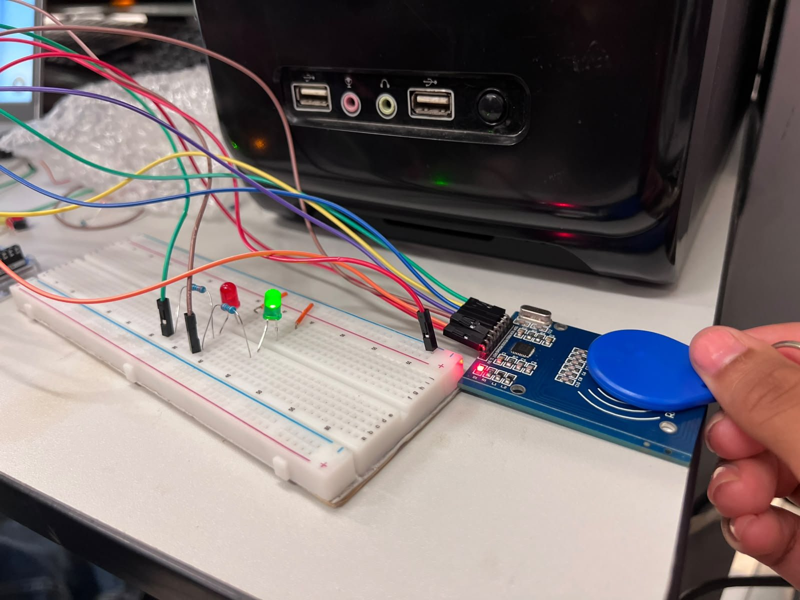
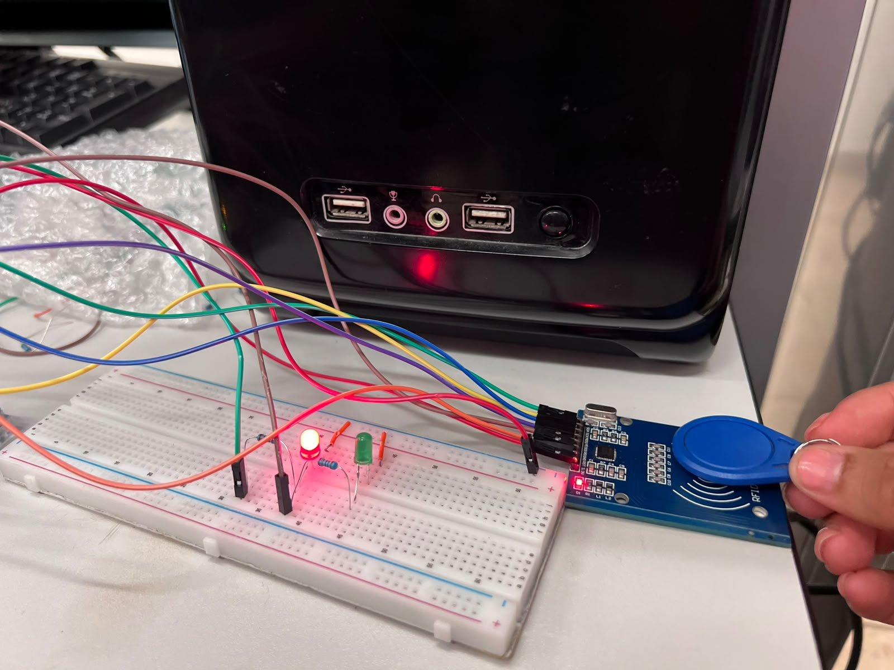

# Control de acceso con lector RFID RC522 por bus SPI

Arduino UNO R4 WiFi · Bus SPI (SCK/MOSI/MISO/SS) · Lector RFID RC522 · LEDs indicadores · `millis()`

## Descripción

Se comunica el Arduino con un lector RFID **RC522** por medio del **bus SPI** para leer el número único (**UID**) de dos llaveros RFID, mostrarlo en el Monitor Serie y usarlo para simular un control de acceso:

- Al arrancar, el programa lee el registro de versión del lector y confirma en el Monitor Serie si hay comunicación con él.
- Cada vez que se acerca una etiqueta se muestra su UID en hexadecimal, con cada byte separado por un espacio (ej. `UID: 99 EB 7B 63`).
- Si el UID coincide con el autorizado se muestra **ACCESO PERMITIDO** y se enciende el LED verde; si no, se muestra **ACCESO DENEGADO**, el LED verde se queda apagado y se enciende el LED rojo como indicador.
- El LED se apaga solo a los **2000 ms**, controlados con `millis()`, y mientras está encendido el programa sigue leyendo etiquetas.

> **Importante:** el RC522 se alimenta con **3.3 V**. Si se conecta a 5 V se puede dañar.

## Objetivos de aprendizaje

- Comprender el funcionamiento del bus SPI y la función de cada línea (SCK, MOSI, MISO y SS/CS).
- Instalar la librería MFRC522 e inicializar el bus y el lector con `SPI.begin()` y `PCD_Init()`.
- Verificar la comunicación con el lector leyendo su registro de versión.
- Leer el UID de una etiqueta, mostrarlo en hexadecimal y compararlo con un UID autorizado guardado en el programa.
- Usar `millis()` en lugar de `delay()` para que el sistema no se bloquee mientras un LED está encendido.

## Material utilizado

- 1 Arduino UNO R4 WiFi
- 1 módulo lector RFID RC522
- 2 llaveros RFID de 13.56 MHz
- 1 LED verde y 1 LED rojo, cada uno con su resistencia limitadora
- 1 protoboard
- Cables de conexión
- Cable USB

Software: Arduino IDE 2, librerías `SPI` (incluida) y `MFRC522` (GithubCommunity, desde el Library Manager), Monitor Serie a 9600 baudios.

## Diagrama del circuito

<table>
  <tr>
    <td colspan="2" align="center"></td>
  </tr>
  <tr>
    <td align="center"></td>
    <td align="center"></td>
  </tr>
</table>

Arriba: diagrama de conexiones. Abajo: armado físico en el Arduino UNO R4 WiFi y en la protoboard.

### Conexiones

| Pin del RC522 | Pin del Arduino | Función |
|---------------|-----------------|---------|
| SDA (SS)      | D10             | Selección del lector (Chip Select) |
| SCK           | D13             | Reloj del bus SPI |
| MOSI          | D11             | Datos Arduino → lector |
| MISO          | D12             | Datos lector → Arduino |
| IRQ           | —               | Sin conectar |
| GND           | GND             | Tierra |
| RST           | D9              | Reinicio del lector |
| 3.3V          | 3.3V            | Alimentación (**no** 5 V) |
| LED verde     | D7              | Acceso permitido |
| LED rojo      | D6              | Acceso denegado |

## Código

- [control_acceso_rfid.ino](Codigo/control_acceso_rfid/control_acceso_rfid.ino): lectura del UID, comparación con el UID autorizado, LEDs temporizados con `millis()` y revisión periódica del lector (si se reinicia por una caída de voltaje, lo vuelve a configurar).

## Video del funcionamiento

Se muestra el circuito armado, el código, el Monitor Serie con los UID leídos y la respuesta de los LEDs al acercar el llavero autorizado y el no autorizado.
- [Readme](Video/Readme.txt)
- [Ver video en YouTube](https://youtu.be/o6up5xnkzOA)

## Resultados

En el Monitor Serie se observó el UID de cada llavero y el resultado de la comparación:

```
UID: 16 D7 DC A1
ACCESO DENEGADO

UID: 99 EB 7B 63
ACCESO PERMITIDO
```

| Etiqueta               | UID          | Resultado        |
|------------------------|--------------|------------------|
| Llavero 1 (autorizado) | 99 EB 7B 63  | ACCESO PERMITIDO |
| Llavero 2              | 16 D7 DC A1  | ACCESO DENEGADO  |

<table>
  <tr>
    <td align="center"></td>
    <td align="center"><br><sub>Llavero autorizado: LED verde</sub></td>
    <td align="center"><br><sub>Llavero no autorizado: LED rojo</sub></td>
  </tr>
</table>

- Aunque los dos llaveros son iguales por fuera, el lector los distingue por su UID, que siempre es el mismo en cada lectura.
- Con el llavero autorizado, el LED verde enciende y se apaga solo a los 2 segundos.
- Con el llavero no autorizado, el LED verde no enciende (se enciende el rojo como indicador).
- El programa no se bloquea mientras un LED está encendido: al usar `millis()` sigue leyendo etiquetas y cada nueva lectura reinicia el conteo.

## Reporte

Reporte formal con introducción, metodología utilizada, capturas del monitor serie y del armado, análisis de resultados, cuestionario y conclusiones individuales.
[Reporte_Control_Acceso_RFID.pdf](Reporte/Reporte_Control_Acceso_RFID.pdf)

## Conclusiones

El bus SPI permite comunicar al Arduino con el lector RC522 usando un reloj (SCK), una línea de datos en cada sentido (MOSI y MISO) y una línea de selección (SS); el UID viaja del lector al Arduino por MISO, por lo que sin esa línea el Arduino no recibe ninguna respuesta y lee 0x00 o 0xFF. El pin que en el módulo dice SDA en realidad funciona como selección del lector, porque el chip también soporta I2C, pero el módulo trabaja en SPI. Para agregar un segundo lector bastaría con compartir SCK, MOSI y MISO y asignarle otro pin SS. Usar `millis()` en lugar de `delay()` permitió que el LED se apagara solo a los 2 segundos sin que el sistema dejara de leer etiquetas, y leer el registro de versión al arrancar permitió comprobar la comunicación con el lector desde el Monitor Serie.
