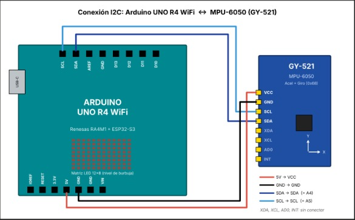
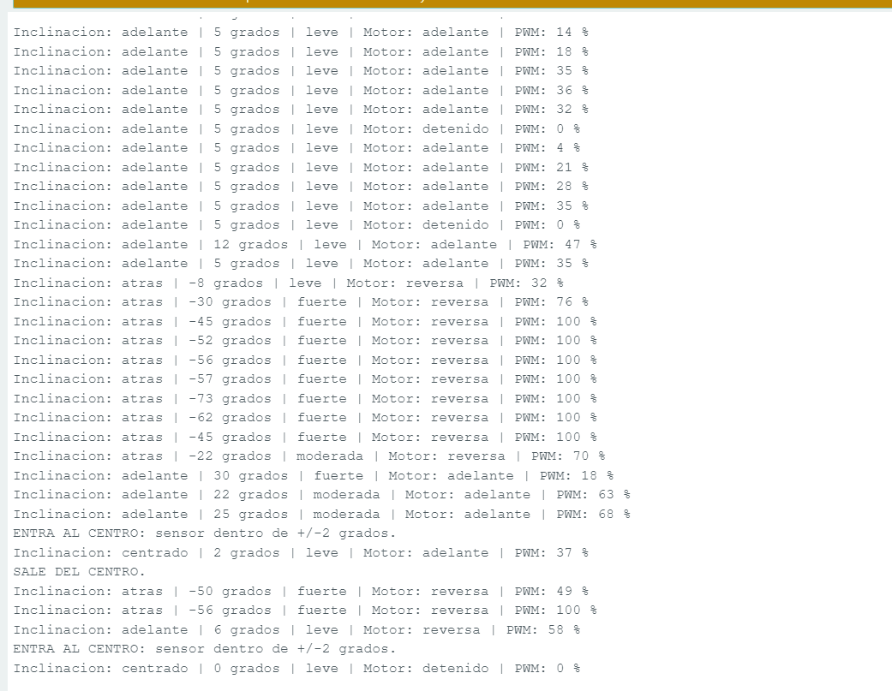
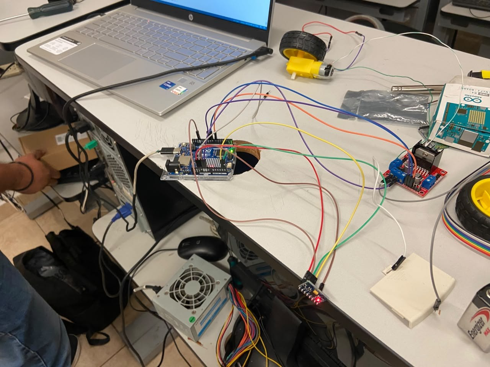
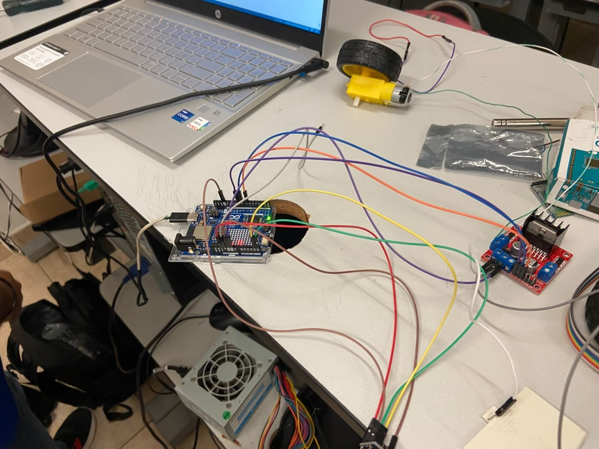
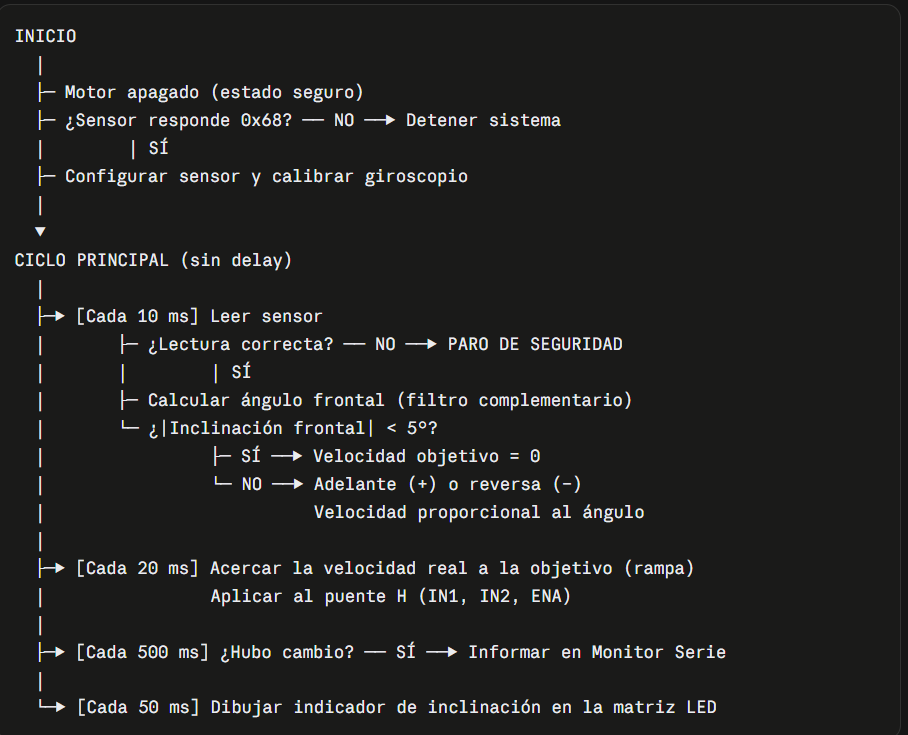

# Inclinómetro con control de motorreductor

Arduino UNO R4 WiFi · MPU-6050 (GY-521) · Puente H L298N · Motorreductor · Matriz LED 12×8

## Descripción

Se mide la inclinación frontal (*pitch*) de un sensor inercial MPU-6050 y con ella se controla un motorreductor de corriente directa: el **signo** del ángulo decide la dirección de giro (adelante o reversa) y su **magnitud** decide la velocidad. El ángulo se obtiene fusionando el acelerómetro y el giroscopio con un filtro complementario, y el motor se maneja a través de un puente H L298N (pines IN1 e IN2 para el sentido y ENA con PWM para la velocidad).

El sistema se comporta así:

- **Zona muerta (±5°):** el motor se detiene para evitar vibraciones por ruido.
- **Velocidad proporcional:** entre 5° y 45° el PWM crece de 90 a 255; a 45° o más va a velocidad máxima.
- **Rampa de aceleración:** cada 20 ms el PWM real se acerca un paso (9 unidades) al objetivo, por lo que tarda unos 0.6 s en ir de detenido a máxima velocidad. Al invertir el sentido, el motor primero se detiene y luego acelera al lado contrario.
- **Seguridad (failsafe):** si falla la lectura del sensor, el motor se detiene de inmediato, se avisa "PARO DE SEGURIDAD" por el Monitor serie y, cuando el sensor responde de nuevo, el sistema se recupera solo.
- **Indicadores:** la matriz LED muestra un punto de 2×2 que sube o baja según la inclinación (marco completo cuando está dentro de ±2°, una X en caso de paro), y el Monitor serie describe la inclinación y el estado del motor solo cuando algo cambia.

## Objetivos de aprendizaje

- Leer un MPU-6050 por I2C accediendo directamente a sus registros (sin biblioteca externa).
- Calcular el ángulo de inclinación con el acelerómetro y combinarlo con el giroscopio mediante un filtro complementario, restando el *offset* obtenido en una calibración de 500 muestras.
- Controlar el sentido de giro de un motor con un puente H (`digitalWrite()`) y su velocidad con PWM (`analogWrite()`).
- Aplicar zona muerta, velocidad mínima útil y rampa de aceleración para proteger el motor.
- Programar cuatro tareas concurrentes con `millis()` y `micros()`, sin `delay()` en el ciclo principal.
- Diseñar un mecanismo de seguridad que detenga el actuador ante la falla del sensor.

## Material utilizado

- Arduino UNO R4 WiFi
- Módulo MPU-6050 (GY-521)
- Módulo puente H L298N
- Motorreductor de CD
- Pila de 9 V
- Cables Dupont

Software: Arduino IDE 2, librerías `Wire` y `Arduino_LED_Matrix` (incluidas en el paquete de la UNO R4) y Monitor serie a 115200 baudios.

## Diagrama del circuito

<table>
  <tr>
    <td></td>
    <td></td>
  </tr>
  <tr>
    <td align="center"></td>
    <td align="center"></td>
  </tr>
</table>

Arriba: conexión I2C entre el Arduino y el MPU-6050, y captura del Monitor serie. Abajo: armado físico.

Diagrama de flujo general del programa:



### Conexiones

| Señal | Arduino UNO R4 WiFi | Destino |
|-------|---------------------|---------|
| Alimentación del sensor | 5V | VCC del MPU-6050 |
| Tierra del sensor | GND | GND del MPU-6050 |
| SDA | A4 | SDA del MPU-6050 |
| SCL | A5 | SCL del MPU-6050 |
| AD0 | — | A GND (dirección 0x68) |
| Velocidad (PWM) | D9 | ENA del L298N (sin jumper) |
| Sentido 1 | D8 | IN1 del L298N |
| Sentido 2 | D7 | IN2 del L298N |

| IN1 | IN2 | Resultado |
|-----|-----|-----------|
| ALTO | BAJO | Gira hacia adelante |
| BAJO | ALTO | Gira en reversa |
| BAJO | BAJO | Detenido |

## Código

- [Inclinometro_IMU.ino](Codigo/Inclinometro_IMU/Inclinometro_IMU.ino): sketch completo. Tiene cuatro tareas programadas con `millis()`/`micros()`:

| Tarea | Periodo | Qué hace |
|-------|---------|----------|
| Sensor y filtro | 10 ms | Lee el MPU-6050, calcula el ángulo y decide el PWM objetivo |
| Rampa y motor | 20 ms | Acerca el PWM real al objetivo y lo aplica al L298N |
| Monitor serie | 500 ms | Informa inclinación y estado del motor solo si algo cambió |
| Matriz LED | 50 ms | Dibuja el indicador de inclinación |

> **Nota:** durante los primeros 5 segundos después de encender o pulsar RESET, el sensor debe permanecer **quieto**: es el tiempo que tarda la calibración del giroscopio (500 muestras). Si el sentido del motor queda invertido respecto a la inclinación, se cambia `SENTIDO_PITCH` a `-1.0f`.

## Video del funcionamiento

Se muestra el inclinómetro en funcionamiento: al inclinar el sensor hacia adelante o hacia atrás el motorreductor cambia de dirección y su velocidad aumenta con el ángulo.

- [Readme](Video/Readme.txt)
- [Ver video en YouTube](https://youtu.be/lv86CP9bxlI?si=P1Oyk19WsESLipIz)

## Resultados

En el Monitor serie se observó el comportamiento esperado. Fragmento de la captura:

```
Inclinacion: adelante | 5 grados | leve | Motor: adelante | PWM: 35 %
Inclinacion: atras | -8 grados | leve | Motor: reversa | PWM: 32 %
Inclinacion: atras | -30 grados | fuerte | Motor: reversa | PWM: 76 %
Inclinacion: atras | -45 grados | fuerte | Motor: reversa | PWM: 100 %
Inclinacion: adelante | 30 grados | fuerte | Motor: adelante | PWM: 18 %
ENTRA AL CENTRO: sensor dentro de +/-2 grados.
SALE DEL CENTRO.
Inclinacion: centrado | 0 grados | leve | Motor: detenido | PWM: 0 %
```

- **Dirección:** inclinación positiva → motor adelante; negativa → motor en reversa.
- **Velocidad proporcional:** a −30° el PWM fue 76 %, que coincide con el cálculo: 90 + (30 − 5)/(45 − 5) × (255 − 90) ≈ 193, es decir, 193/255 ≈ 76 %. A 45° o más (−45°, −52°, −73°…) el PWM se mantuvo en 100 %.
- **Velocidad mínima útil:** con 5° de inclinación el PWM objetivo es 90 (≈ 35 %), que es el valor al que el motor ya puede vencer la fricción de los engranes.
- **Rampa:** al pasar de reversa (−56°) a adelante (30°), el PWM aparece en 18 % en lugar de saltar a su valor final: el motor primero se detuvo y luego fue subiendo en sentido contrario, tal como lo hace la rampa de 9 unidades cada 20 ms. Los valores intermedios como 14 %, 18 % o 21 % con 5° corresponden a esa misma transición.
- **Zona muerta:** cerca de 5° el ángulo oscila alrededor del límite, por lo que el motor alterna entre "adelante" y "detenido"; al quedar el sensor dentro de ±2° el sistema anunció una sola vez "ENTRA AL CENTRO" y el motor quedó detenido con 0 %.
- **Monitor serie:** solo imprime cuando cambia algún dato, y los avisos de entrada y salida del centro aparecen una vez por evento.

## Reporte

Reporte formal con introducción, metodología, evidencia del armado y del Monitor serie, análisis de resultados y conclusiones individuales.

[Reporte_Unidad_Medicion_Inercial_MPU6050.pdf](Reporte/Reporte_Unidad_Medicion_Inercial_MPU6050.pdf)

## Conclusiones

El MPU-6050 por sí solo no da un ángulo confiable: el acelerómetro es ruidoso ante vibraciones y el giroscopio se desvía con el tiempo, por eso el filtro complementario (que toma lo rápido del giroscopio y lo estable del acelerómetro) y la calibración del *offset* con el sensor quieto fueron esenciales. El puente H L298N separa la lógica del Arduino de la potencia del motor: IN1 e IN2 definen el sentido y el PWM en ENA define la velocidad. La zona muerta, la velocidad mínima de 90 y la rampa hicieron que el motor respondiera de forma estable y sin cambios bruscos de sentido, y el esquema de cuatro tareas con `millis()` permitió leer el sensor a 100 Hz sin bloquear el motor, el Monitor serie ni la matriz LED. Finalmente, el failsafe confirma un principio de diseño: si no hay información del sensor, lo seguro es detener el actuador.
