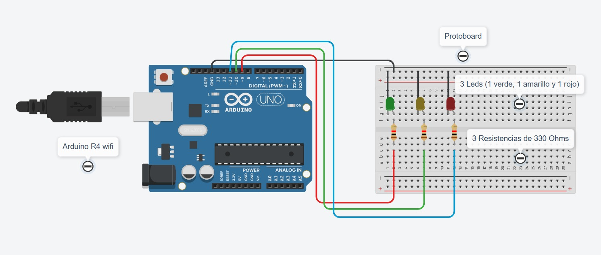
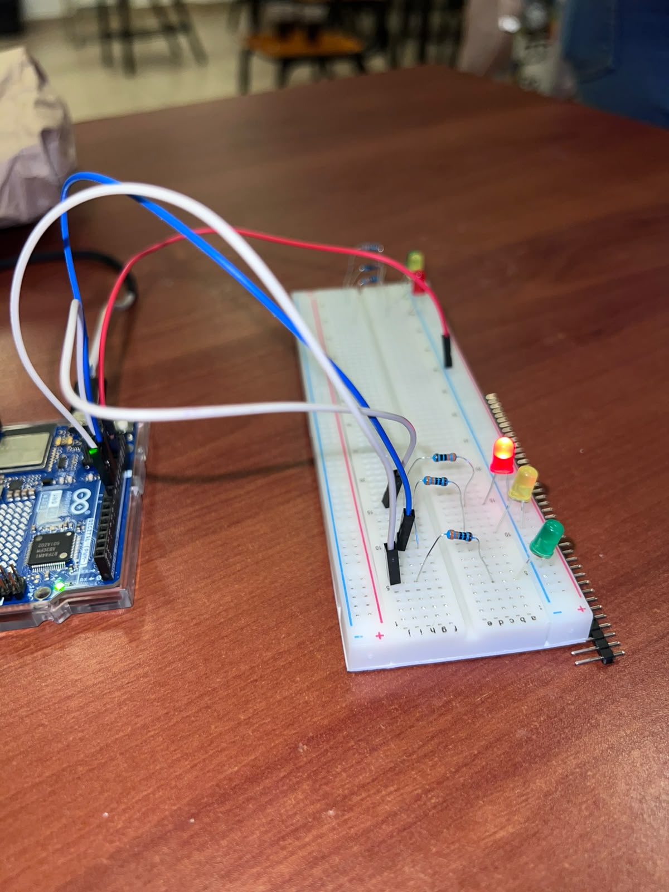
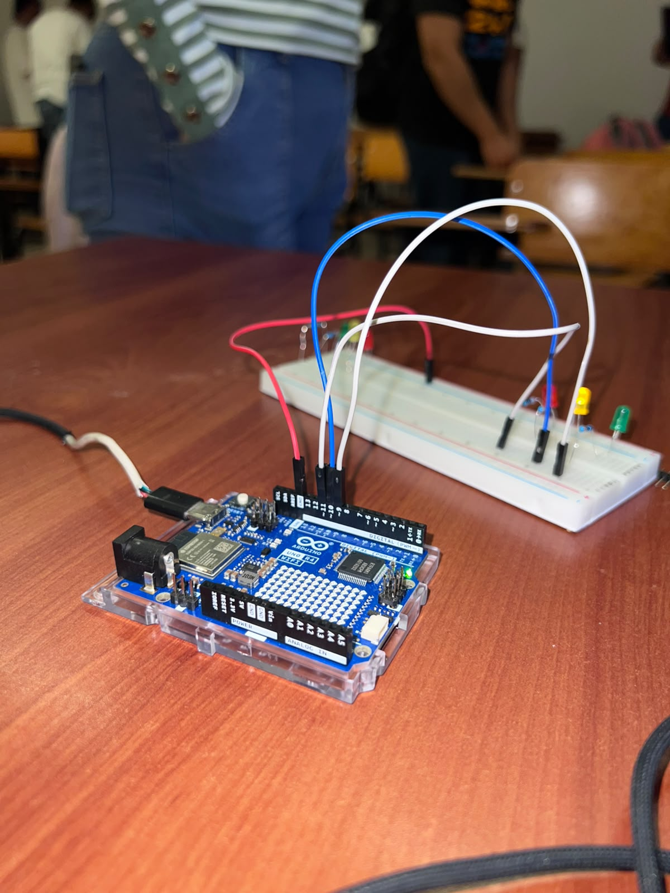
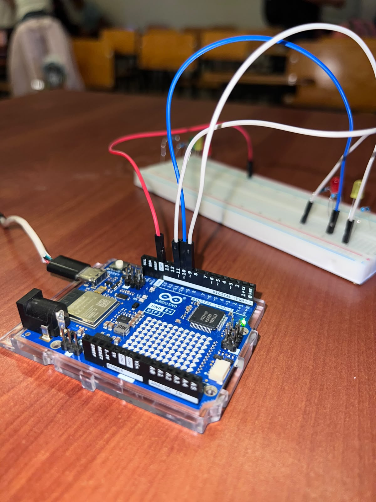
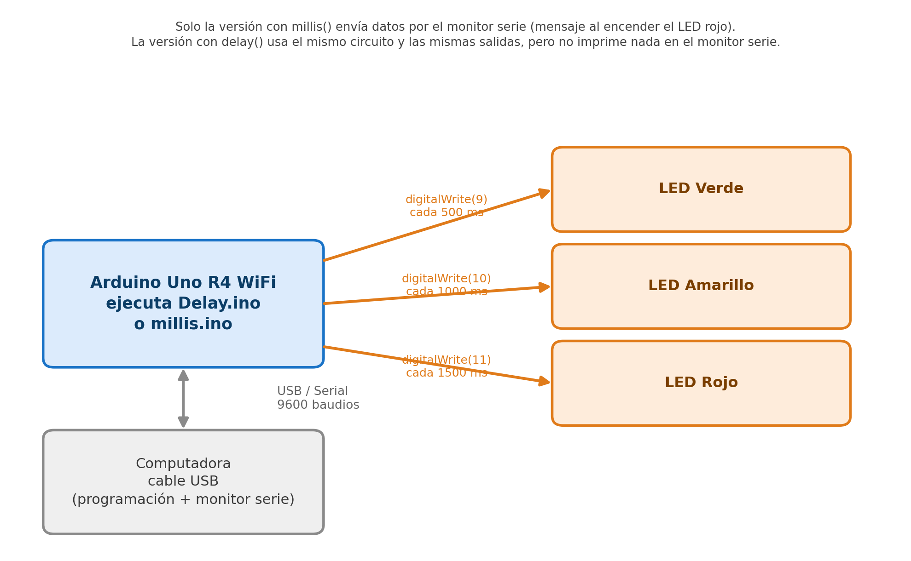

# Comparación de delay() y millis() con Arduino

Arduino Uno R4 WiFi · 3 LEDs · Temporización bloqueante vs. no bloqueante

## Descripción

Esta práctica compara dos formas de manejar tiempos en Arduino: la función `delay()`, que detiene por completo la ejecución del programa mientras espera, y la función `millis()`, que permite llevar el conteo del tiempo sin bloquear el resto del código. Para comparar ambas se usó el mismo circuito con tres LEDs (verde, amarillo y rojo), cada uno con un intervalo de tiempo distinto, programado primero con `delay()` y después con `millis()`.

## Objetivos de aprendizaje

- Controlar la temporización de varias salidas digitales con `delay()`.
- Controlar la temporización de varias salidas digitales de forma no bloqueante con `millis()`, usando la técnica de "tiempo anterior" (`unsigned long`) por cada LED.
- Comparar el comportamiento de un programa bloqueante contra uno no bloqueante cuando se manejan varios eventos con tiempos distintos al mismo tiempo.
- Usar el monitor serie para reportar un evento (encendido del LED rojo) sin depender de `delay()`.

## Material utilizado

- Arduino Uno R4 WiFi
- 3 LEDs (1 verde, 1 amarillo, 1 rojo)
- 3 resistencias de 330 Ω
- Protoboard
- Cables Dupont

## Diagrama del circuito

  

El mismo circuito se usó para las dos versiones del código (delay y millis).

### Diagrama de bloques

Solo la versión con `millis()` envía datos por el monitor serie (el mensaje al encender el LED rojo); la versión con `delay()` usa el mismo circuito y las mismas salidas, pero no imprime nada en el monitor serie.

## Código

- [Delay.ino](Codigo/Delay/Delay.ino): versión con `delay()`.
- [millis.ino](Codigo/Millis/millis.ino): versión con `millis()`.

### Versión con delay()

Enciende y apaga cada LED uno por uno, de forma secuencial: verde medio segundo, amarillo un segundo y rojo segundo y medio. Como `delay()` detiene todo el programa mientras espera, los LEDs nunca están encendidos al mismo tiempo ni parpadean de forma independiente entre sí: cada uno tiene que esperar su turno.

### Versión con millis()

Guarda en una variable (`tiempoVerde`, `tiempoAmarillo`, `tiempoRojo`) el último momento en que cada LED cambió de estado, y en cada vuelta del `loop()` compara `millis()` contra ese valor. Así, cada LED cambia de estado en su propio intervalo (500, 1000 y 1500 ms) sin esperar a los demás ni bloquear el programa, por lo que los tres pueden estar encendidos o parpadeando al mismo tiempo de forma independiente. Además, cada vez que el LED rojo se enciende, se envía por el monitor serie (9600 baudios) el mensaje `"Ximena la mas chambeadora"`.

## Video del funcionamiento

Muestra el mismo circuito ejecutando ambas versiones: con `delay()` los LEDs
parpadean en secuencia, uno a la vez; con `millis()` lo hacen de forma independiente,
pudiendo coincidir dos encendidos a la vez.
- Versión con `delay()`: [Ver video en YouTube](https://youtu.be/zXMxCz9uoMA?si=Up6rGS999ETC38SV)
- Versión con `millis()`: [Ver video en YouTube](https://youtu.be/gIHIuMy8Fag?si=nVLI3jlfM2oAtlDP)

## Resultados

Las pruebas se realizaron el 15 de septiembre de 2026, comparando `Delay.ino` y `millis.ino`
sobre el mismo circuito de 3 LEDs (verde, amarillo y rojo cada 500/1000/1500 ms).

- **delay():** los LEDs se encienden uno a la vez, nunca al mismo tiempo; el ciclo dura
  exactamente 3000 ms y se repite en ese orden.
- **millis():** cada LED cambia de estado en su propio intervalo sin esperar a los demás; verde
  y rojo llegan a coincidir encendidos (2500–3000 ms), algo que `delay()` nunca permite.
- Solo `millis()` envía por el monitor serie el mensaje **"Ximena la mas chambeadora"**, justo
  al encender el LED rojo (cada 3000 ms); `delay()` no usa el monitor serie.

## Reporte

Reporte formal con introducción, metodologia utilizada, capturas de la web funcionando, análisis de resultados y conclusiones individuales. 
[Reporte_practica3.pdf](Reporte/Reporte_Delay_Millis (1).pdf)

## Conclusiones

La práctica permitió comparar de forma directa dos maneras de manejar el tiempo en Arduino. Con `delay()` el programa es más sencillo de escribir, pero al detener por completo la ejecución impide que varios eventos ocurran de forma independiente: los tres LEDs terminan parpadeando uno después del otro en vez de simultáneamente. Con `millis()` el código es un poco más complejo, porque hay que llevar el registro del último cambio de cada LED en una variable, pero a cambio el programa nunca se detiene y cada LED respeta su propio intervalo sin afectar a los demás, lo que además permite hacer otras tareas al mismo tiempo, como enviar un mensaje por el monitor serie. Esto deja claro por qué `millis()` es la opción recomendada cuando un proyecto necesita manejar varios tiempos o eventos a la vez.

