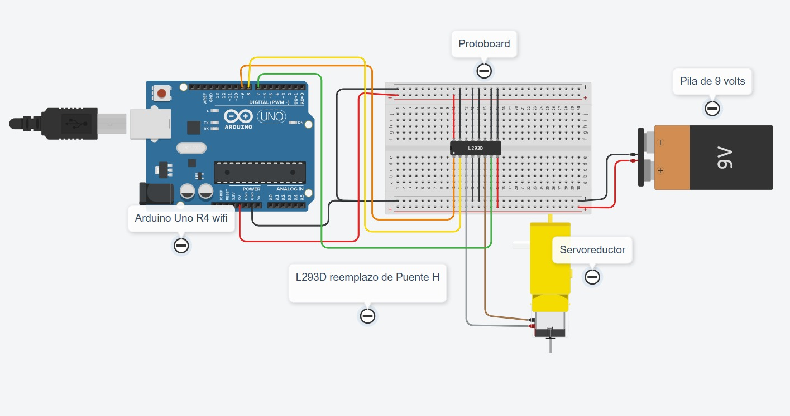

# Control de motorreductor por voz con Arduino y puente H L293D

## Descripción

El objetivo de esta práctica es controlar un motorreductor por medio de comandos de voz. El Arduino Uno R4 WiFi recibe la orden y, a través del puente H L293D, hace que el motor avance, retroceda o se detenga.

## Objetivos de aprendizaje

Programar y simular en Arduino el control de un motorreductor de corriente directa usando un puente H (L293D): definir el sentido de giro con las salidas digitales de los pines 7 y 8 (`digitalWrite()`) y regular la velocidad con una señal PWM en el pin 9 (`analogWrite()`), para que el motor avance, retroceda o se detenga según el comando de voz recibido.

## Material utilizado

* Arduino Uno R4 WiFi
* Puente H (en la simulación de Tinkercad se usó el circuito integrado L293D)
* Motorreductor
* Pila de 9 V
* Protoboard
* Cables Dupont

## Diagrama del circuito

### Conexiones

| Elemento | Pata del L293D | Función |
|---|---|---|
| 5 V del Arduino | 16 (VCC1) | Alimenta la parte del L293D que recibe las órdenes |
| Positivo (+) de la pila de 9 V | 8 (VCC2) | Alimenta el motor |
| Pin 9 del Arduino | 1 (Enable 1) | Controla la velocidad del motor (PWM) y permite detenerlo |
| Pin 8 del Arduino | 2 (Entrada 1) | Junto con el pin 7, define el sentido de giro |
| Pin 7 del Arduino | 7 (Entrada 2) | Junto con el pin 8, define el sentido de giro |
| Terminales del motor | 3 y 6 (Salidas 1 y 2) | Una terminal en cada pata; por ahí llega la energía al motor |
| GND del Arduino y negativo (−) de la pila | 4, 5, 12 y 13 (GND) | Tierra común para que todo comparta la misma referencia eléctrica |
| Negativo común (GND) | 9, 10 y 15 | Mantienen apagado el segundo canal del L293D, que no se usa |
| Sin conectar | 11 y 14 | Salidas del segundo canal |

### Función de cada componente

* **Arduino Uno R4 WiFi:** ejecuta el programa y envía las órdenes para que el motor avance, retroceda o se detenga.
* **Puente H L293D:** recibe las órdenes del Arduino y controla la energía que llega al motor para cambiar su velocidad y sentido de giro.
* **Motorreductor:** convierte la energía eléctrica en movimiento. Sus engranajes reducen la velocidad y aumentan la fuerza de giro.
* **Pila de 9 V:** proporciona la energía para mover el motor.
* **Protoboard:** permite unir los componentes con cables sin soldarlos.

### Tabla de funcionamiento

| Acción | Pin 9 (pata 1) | Pin 8 (pata 2) | Pin 7 (pata 7) |
|---|---|---|---|
| Avanzar | PWM | HIGH | LOW |
| Retroceder | PWM | LOW | HIGH |
| Detener | 0 (LOW) | Cualquiera | Cualquiera |

El valor PWM del pin 9 va de 0 a 255: cuanto más alto, más rápido gira el motor. El sentido que corresponde a "avanzar" depende de cómo se conectaron las terminales del motor en las patas 3 y 6; si gira al revés, basta con intercambiarlas.

## Código

[motorvoz.ino](Practica/codigos/motorvoz.ino)

## Video del funcionamiento

* [Readme](Practica/Video/Readme.txt)
* [Ver video en YouTube](https://youtu.be/HVi7jjqaD8g?si=P1OTq7G0HO8tRpMl)

## Evidencias de armado

## Reporte

Incluye: [Resultados.pdf](Practica/Resultados/Resultados.pdf)

* Gráficas (si aplica)
* Tablas de datos
* Observaciones sobre el comportamiento del sistema

## Conclusiones

La práctica permitió comprender cómo se controla un motor de corriente directa con Arduino por medio de un puente H: con salidas digitales (`digitalWrite`) se define el sentido de giro y con una señal PWM (`analogWrite`) se regula la velocidad, de modo que cada comando de voz se traduce en una acción del motor. También quedó clara la importancia de alimentar el motor con una fuente externa, ya que los pines del Arduino no pueden entregar la corriente que necesita, y de unir las tierras del Arduino, la pila y el L293D en un negativo común, porque sin esa referencia compartida el puente H no interpretaría correctamente las señales del Arduino.

## Resultados

[Resultados.pdf](Practica/Resultados/Resultados.pdf)

Este documento contiene la descripción de la práctica, objetivos y procedimientos realizados.

* Reporte técnico estilo IEEE (PDF)
* Datos CSV (si aplica)
* Diagramas adicionales
