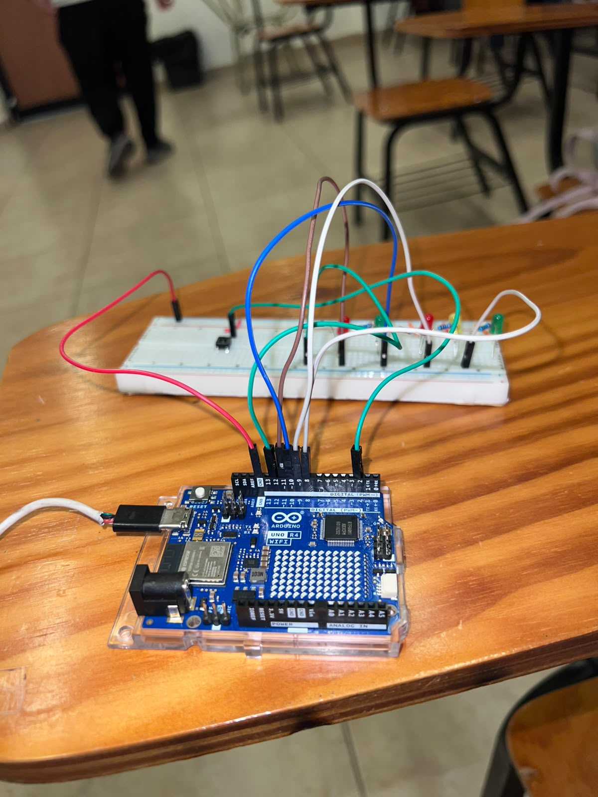

# Semáforo peatonal con botón

Arduino Uno R4 WiFi · 5 LEDs (semáforo de autos + semáforo peatonal) · Pushbutton con antirrebote

## Descripción

El proyecto simula un semáforo de una calle con cruce peatonal. El semáforo de autos cambia solo, en un ciclo repetido de verde, amarillo y rojo. El semáforo peatonal permanece en rojo la mayor parte del tiempo, y solo se pone en verde cuando alguien presiona un botón para solicitar el cruce: la solicitud se guarda y se atiende en cuanto el semáforo de autos llega a rojo.

## Objetivos de aprendizaje

- Controlar varias salidas digitales de forma no bloqueante con `millis()`, usando una máquina de estados (verde, amarillo, rojo) con duraciones distintas para cada una.
- Leer un botón con `INPUT_PULLUP` y aplicar antirrebote (debounce) por software, sin usar `delay()`.
- Guardar una solicitud del usuario (botón) en una variable (`solicitudPeaton`) y atenderla únicamente en el momento adecuado del ciclo, no de inmediato.
- Diseñar la lógica para que el cruce peatonal solo se habilite cuando es seguro (con los autos en rojo).

## Material utilizado

- Arduino Uno R4 WiFi
- 5 LEDs (2 verdes, 2 rojos y 1 amarillo)
- 5 resistencias de 220 Ω
- 1 pushbutton
- Protoboard
- Cables Dupont

## Diagrama del circuito

 

## Código

Este es el código de la práctica: 
[Semaforo_Peatonal.ino](Codigo/Semaforo_Peatonal.ino)

## Video del funcionamiento

Muestra el circuito armado y en funcionamiento, con el botón presionado en distintos
momentos del ciclo para comprobar ambos comportamientos: peatonal en rojo sin solicitud, y
peatonal en verde cuando sí se presionó a tiempo:
[Ver video en YouTube](https://youtu.be/Fw5TZOuojWg?si=uEQRUvMrNa91d_S3)

## Resultados

Las pruebas se realizaron el 15 de septiembre de 2026. El comportamiento del semáforo se
determinó a partir del código fuente (`Codigo/Semaforo_Peatonal.ino`) y se verificó en el
armado físico, presionando el botón en distintos momentos del ciclo.

El semáforo de autos sigue siempre el mismo ciclo de **14000 ms** (6000 ms en verde, 2000 ms
en amarillo y 6000 ms en rojo), sin detenerse ni alterarse por el botón. El semáforo peatonal,
en cambio, depende de si se presionó el botón durante el verde o el amarillo de los autos:

- **Sin solicitud de cruce:** el peatonal permanece en rojo durante todo el ciclo (0–14000 ms).
- **Con solicitud durante verde o amarillo:** el peatonal está en rojo de 0 a 8000 ms y cambia
  a verde de 8000 a 14000 ms, exactamente mientras los autos están en rojo.
- **Solicitud presionada durante el rojo de autos:** no tiene ningún efecto, ya que en ese
  momento la solicitud ya se resolvió o no hay forma segura de atenderla.

La solicitud de cruce se guarda en la variable `solicitudPeaton` y se atiende una sola vez,
justo cuando el semáforo de autos pasa de amarillo a rojo; después la variable se reinicia,
por lo que una sola pulsación del botón solo genera un cruce peatonal. El antirrebote por
software (**40 ms**) evitó que una sola pulsación física se interpretara como varias
solicitudes. El armado físico y el video de la práctica confirmaron visualmente este
comportamiento: el semáforo de autos corre solo, y el peatonal solo se pone en verde cuando
el botón se presionó a tiempo.

## Reporte

Reporte formal con introducción, metodologia utilizada, capturas de la web funcionando, análisis de resultados y conclusiones individuales. 
Incluye: [Reporte_semaforo.pdf](Reporte/Reporte_Semaforo_Peatonal.pdf). 

## Conclusiones

La práctica permitió implementar un semáforo de autos y un semáforo peatonal funcionando de forma coordinada, usando una sola máquina de estados no bloqueante basada en `millis()`. El semáforo de autos nunca se detiene ni cambia su ritmo, sin importar si el botón se presiona o no, lo que confirma que su ciclo está desacoplado de la lógica del peatón. La solicitud de cruce se guarda en una variable (`solicitudPeaton`) y solo se atiende cuando el semáforo de autos llega a rojo, que es el único momento seguro para habilitar el paso; presionar el botón durante el rojo no tiene ningún efecto, porque en ese momento el cruce ya se resolvió o se está resolviendo. El antirrebote por software (40 ms) evitó que una sola pulsación se registrara como varias, y el uso de `INPUT_PULLUP` simplificó la conexión del botón al no requerir una resistencia externa. En conjunto, la práctica muestra cómo combinar una máquina de estados con la lectura de una entrada externa sin bloquear el programa ni poner en riesgo la seguridad del cruce.

