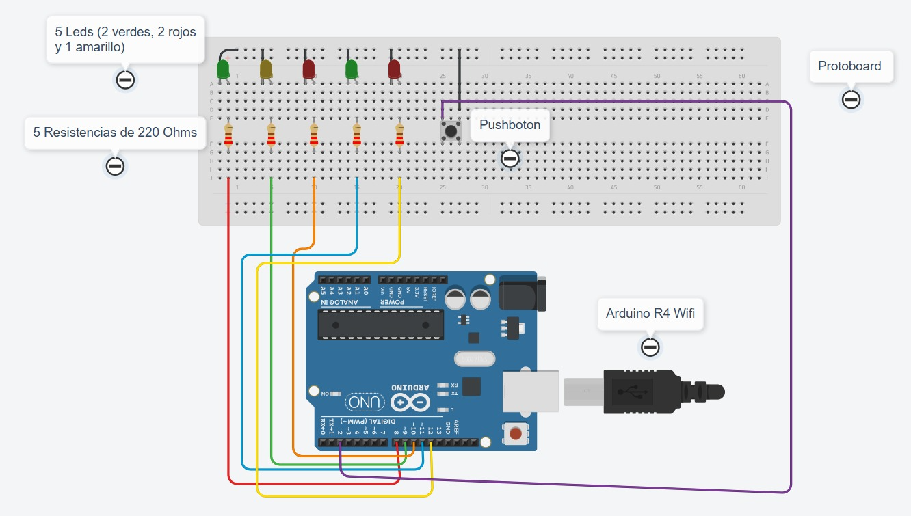
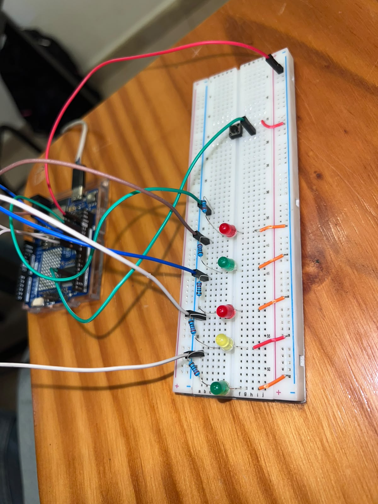

# Semáforo peatonal con botón

Arduino Uno R4 WiFi · 5 LEDs (semáforo de autos + semáforo peatonal) · Pushbutton con antirrebote

## Descripción

El proyecto simula un semáforo de una calle con cruce peatonal. El semáforo de autos cambia solo, en un ciclo repetido de verde, amarillo y rojo. El semáforo peatonal permanece en rojo la mayor parte del tiempo, y solo se pone en verde cuando alguien presiona un botón para solicitar el cruce: la solicitud se guarda y se atiende en cuanto el semáforo de autos llega a rojo.

## Objetivos de aprendizaje

- Controlar varias salidas digitales de forma no bloqueante con `millis()`, usando una máquina de estados (verde, amarillo, rojo) con duraciones distintas para cada una.
- Leer un botón con `INPUT_PULLUP` y aplicar antirrebote (debounce) por software, sin usar `delay()`.
- Guardar una solicitud del usuario (botón) en una variable (`solicitudPeaton`) y atenderla únicamente en el momento adecuado del ciclo, no de inmediato.
- Diseñar la lógica para que el cruce peatonal solo se habilite cuando es seguro (con los autos en rojo).

## Material utilizado

- Arduino Uno R4 WiFi
- 5 LEDs (2 verdes, 2 rojos y 1 amarillo)
- 5 resistencias de 220 Ω
- 1 pushbutton
- Protoboard
- Cables Dupont

## Diagrama del circuito



### Conexiones

| Elemento | Pin del Arduino | Función |
|---|---|---|
| LED rojo (semáforo peatonal) | Pin 12 | Encendido casi todo el tiempo; se apaga cuando se atiende el cruce |
| LED verde (semáforo peatonal) | Pin 11 | Se enciende solo cuando se atiende una solicitud de cruce |
| LED rojo (semáforo autos) | Pin 10 | Encendido durante el estado "rojo" (6 s) |
| LED amarillo (semáforo autos) | Pin 9 | Encendido durante el estado "amarillo" (2 s) |
| LED verde (semáforo autos) | Pin 8 | Encendido durante el estado "verde" (6 s) |
| Pushbutton | Pin 2 (`INPUT_PULLUP`) | Solicita el cruce peatonal; presionado = LOW |

### Función de cada componente

- **Arduino Uno R4 WiFi:** ejecuta la máquina de estados del semáforo y lee el botón.
- **Semáforo de autos (verde/amarillo/rojo):** cambia de estado solo, siguiendo siempre el mismo ciclo de tiempos.
- **Semáforo peatonal (rojo/verde):** normalmente en rojo; solo pasa a verde si hubo una solicitud pendiente cuando el semáforo de autos llega a rojo.
- **Pushbutton:** permite a un peatón solicitar el cruce; el programa filtra los rebotes eléctricos del botón antes de tomar la lectura como válida.
- **Resistencias de 220 Ω:** limitan la corriente de cada LED.
- **Protoboard:** permite armar el circuito sin soldar los componentes.

## Código

[Semaforo_Peatonal.ino](Codigo/Semaforo_Peatonal.ino)

### Máquina de estados del semáforo de autos

| Estado | Duración | LED de autos encendido |
|---|---|---|
| 0 — Verde | 6000 ms | Verde (pin 8) |
| 1 — Amarillo | 2000 ms | Amarillo (pin 9) |
| 2 — Rojo | 6000 ms | Rojo (pin 10) |

El programa guarda en `inicioEstado` el momento (`millis()`) en que empezó el estado actual, y compara contra `ahora - inicioEstado` para saber cuándo pasar al siguiente estado, sin usar `delay()` en ningún momento.

### Lectura del botón y solicitud de cruce

Cada vuelta del `loop()` se lee el botón (`digitalRead(boton)`). Para evitar que los rebotes eléctricos del botón se cuenten como varias pulsaciones, el programa solo acepta un cambio de estado del botón si se mantuvo estable durante al menos 40 ms (`antirrebote`). Si el botón se presiona (pasa a LOW) mientras el semáforo de autos está en verde o en amarillo (estado 0 o 1), se activa la bandera `solicitudPeaton = true`; presionarlo durante el rojo no hace nada, porque en ese momento el cruce ya se está resolviendo o ya se resolvió.

### Atención de la solicitud

Cuando el semáforo de autos termina el amarillo y pasa a rojo, el programa revisa `solicitudPeaton`: si estaba activa, enciende el LED verde peatonal y apaga el rojo peatonal; si no hubo solicitud, el semáforo peatonal se queda en rojo. En cualquier caso, `solicitudPeaton` se reinicia a `false`, y cuando el semáforo de autos vuelve a verde, el peatonal siempre regresa a rojo, haya cruzado alguien o no.

## Terminal

Ver [Readme](Terminal/Readme.txt): este programa no usa el monitor serie.

## Video del funcionamiento

[Ver video en YouTube](https://youtu.be/Fw5TZOuojWg?si=uEQRUvMrNa91d_S3)

## Evidencias de armado

 

## Resultados

Ver [Readme](Resultados/Readme.txt) — pendiente de completar.

## Reporte

Ver [Readme](Reporte/Readme.txt) — pendiente de completar.

## Estructura de carpetas

```
Semaforo/
├── README.md
├── Codigo/
│   └── Semaforo_Peatonal.ino
├── Diagrama/                 ← esquemático (Tinkercad)
├── Imagenes/                 ← fotos del armado
├── Terminal/                 ← el programa no usa monitor serie
├── Resultados/                ← pendiente
├── Reporte/                   ← pendiente
└── Video/                     ← enlace al video
```
