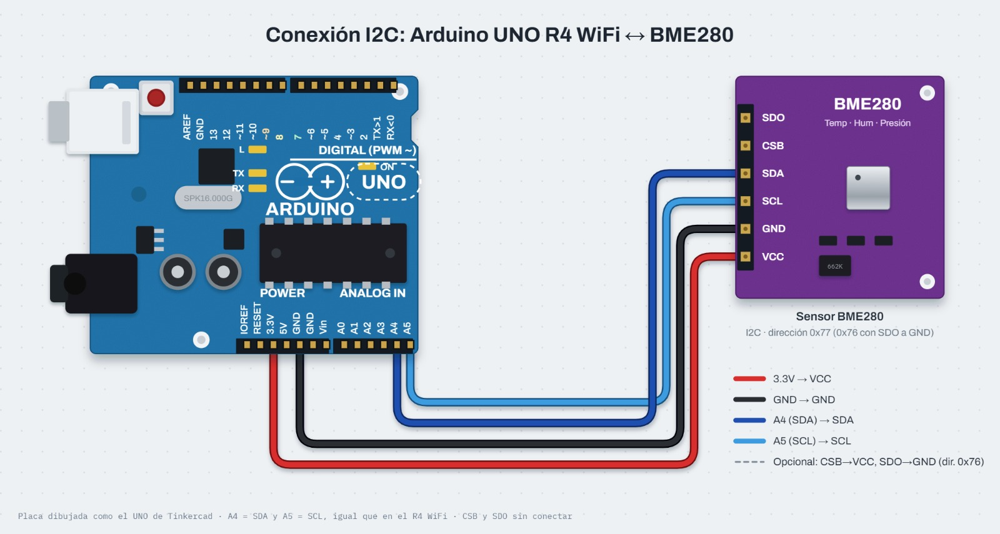
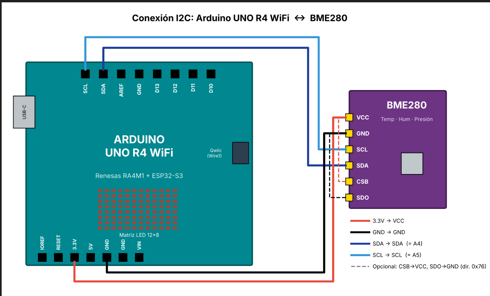
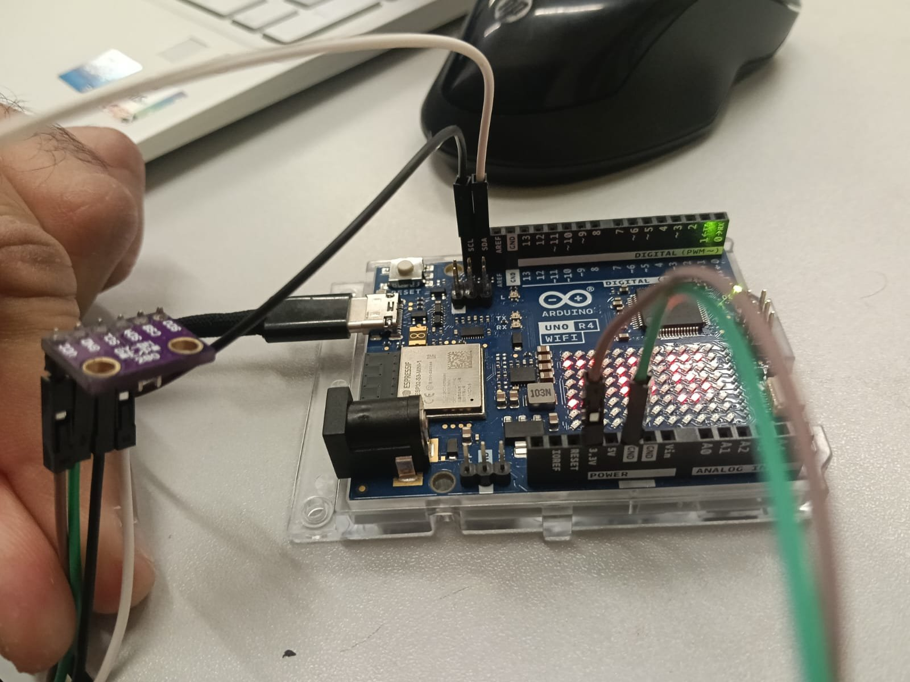
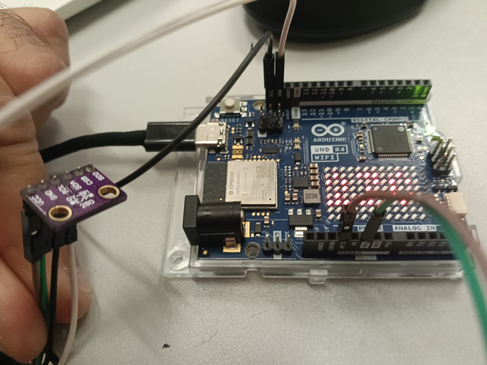
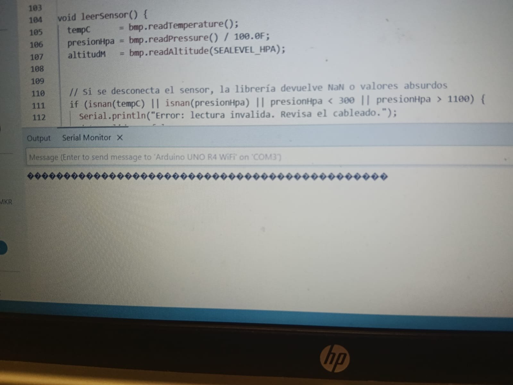

# Sensor ambiental de precisión (BME280/BMP280)

Arduino UNO R4 WiFi · Bus I2C (SDA/SCL) · Sensor BMP280/BME280 · Matriz LED 12×8 · `millis()`

## Descripción

Estación barométrica con el sensor **BMP280** de Bosch conectado por **I2C** al Arduino UNO R4 WiFi:

- Al arrancar, el programa busca el sensor en las direcciones **0x76** y **0x77** y lo identifica leyendo su Chip ID en el registro `0xD0` (0x58 = BMP280, 0x60 = BME280).
- Cada **1000 ms** lee temperatura (°C), presión (hPa) y altitud (m), y las envía al Monitor Serie en formato `etiqueta:valor`, compatible con el **Serial Plotter**.
- Cada **2500 ms** alterna en la **matriz LED** la temperatura (ej. `27C`) y la altitud (ej. `8m`).
- Si una lectura es inválida (NaN o presión fuera de 300–1100 hPa) muestra `ERR` y vuelve a buscar el sensor cada **5000 ms**.
- Todo se temporiza con `millis()`, sin `delay()`.

> **Importante:** el Monitor Serie y el Serial Plotter deben estar a **115200 baudios**.

## Objetivos de aprendizaje

- Conectar un sensor al bus I2C y detectarlo por su dirección y su Chip ID.
- Configurar el muestreo del BMP280 (modo normal, sobremuestreo y filtro IIR).
- Calcular la altitud a partir de la presión con la fórmula barométrica y la presión a nivel del mar del día.
- Mostrar datos en el Monitor Serie, el Serial Plotter y la matriz LED del UNO R4 WiFi.
- Manejar varias tareas con `millis()` y detectar cuando el sensor se desconecta.

## Material utilizado

- 1 Arduino UNO R4 WiFi
- 1 módulo sensor BMP280/BME280 (6 pines: VCC, GND, SCL, SDA, CSB, SDO)
- 4 cables de conexión
- Cable USB-C

Software: Arduino IDE 2 con **Adafruit BMP280 Library**, **Adafruit Unified Sensor** y **ArduinoGraphics** (Gestor de librerías). `Arduino_LED_Matrix` ya viene con la placa R4.

## Diagrama del circuito

<table>
  <tr>
    <td></td>
    <td></td>
  </tr>
  <tr>
    <td align="center"></td>
    <td align="center"></td>
  </tr>
</table>

Arriba: diagrama de conexión I2C y conexión sobre el UNO R4 WiFi. Abajo: armado físico con la matriz LED mostrando un valor.

### Conexiones

| Pin del sensor | Pin del Arduino | Función |
|----------------|-----------------|---------|
| VCC            | 3.3V            | Alimentación |
| GND            | GND             | Tierra |
| SCL            | SCL (= A5)      | Reloj I2C |
| SDA            | SDA (= A4)      | Datos I2C |
| CSB            | —               | Sin conectar (modo I2C) |
| SDO            | —               | Sin conectar (a GND = 0x76, a VCC = 0x77) |

En el UNO R4 WiFi los pines SDA/SCL junto a AREF son los mismos que A4/A5 (`Wire`). El conector Qwiic usa `Wire1` (cambiar `USE_QWIIC` a 1).

## Código

- [estacion_bmp280.ino](Codigo/estacion_bmp280/estacion_bmp280.ino): detección por Chip ID, lectura cada 1 s, salida para Serial Plotter, matriz LED alternando temperatura y altitud, y reconexión automática.

Ejemplo del formato de salida:

```
Temp_C:<valor>,Presion_Atm_hPa:<valor>,Altura_nivel_mar_m:<valor>
```

## Video del funcionamiento

Se muestra el sensor conectado por I2C, el código y la matriz LED del UNO R4 WiFi mostrando las lecturas.
- [Readme](Video/Readme.txt)
- [Ver video en YouTube](https://youtu.be/ox5LbVQqwLA)

## Resultados

- La matriz LED mostró valores numéricos y no `ERR`, lo que indica que el programa encontró el sensor y obtuvo lecturas válidas.
- En una de las pruebas el Monitor Serie mostró solo símbolos `�`: estaba a una velocidad distinta de la del programa (`Serial.begin(115200)`). Se corrige seleccionando **115200 baud** en el Monitor Serie. En el R4 WiFi el USB pasa por el ESP32-S3, que funciona como puente USB-serie, así que la velocidad sí debe coincidir.



- La altitud depende de la presión a nivel del mar configurada (`SEALEVEL_HPA = 1005.0`). Cerca del nivel del mar, **1 hPa ≈ 8.4 m**:

| Presión medida (hPa) | Altitud calculada (m) |
|----------------------|-----------------------|
| 1005.00              | 0.0                   |
| 1004.00              | 8.4                   |
| 1000.00              | 42.1                  |
| 1013.25              | −69.0                 |

## Reporte

Reporte formal con introducción, metodología utilizada, evidencia del armado, análisis de resultados y conclusiones individuales.
[Reporte_Sensor_Ambiental_BMP280.pdf](Reporte/Reporte_Sensor_Ambiental_BMP280.pdf)

## Conclusiones

El BMP280 se comunica por I2C con solo dos líneas de datos más alimentación, y leer su Chip ID en el registro `0xD0` permite saber si es un BMP280 o un BME280 antes de iniciar la librería. La altitud no se mide directamente: se calcula a partir de la presión, por lo que ajustar la presión a nivel del mar del día es indispensable para que el valor sea correcto. Usar `millis()` permitió leer el sensor, actualizar la matriz LED y buscar el sensor cuando se desconecta sin que ninguna tarea bloqueara a las demás. Por último, la velocidad del Monitor Serie debe coincidir con la de `Serial.begin()`: con otra velocidad solo aparecen símbolos inválidos aunque el circuito funcione bien.
