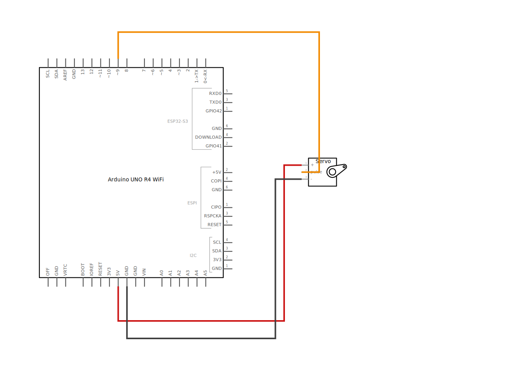
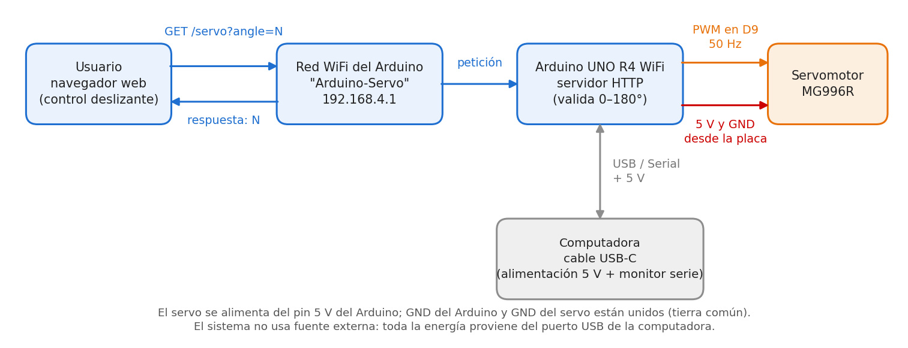
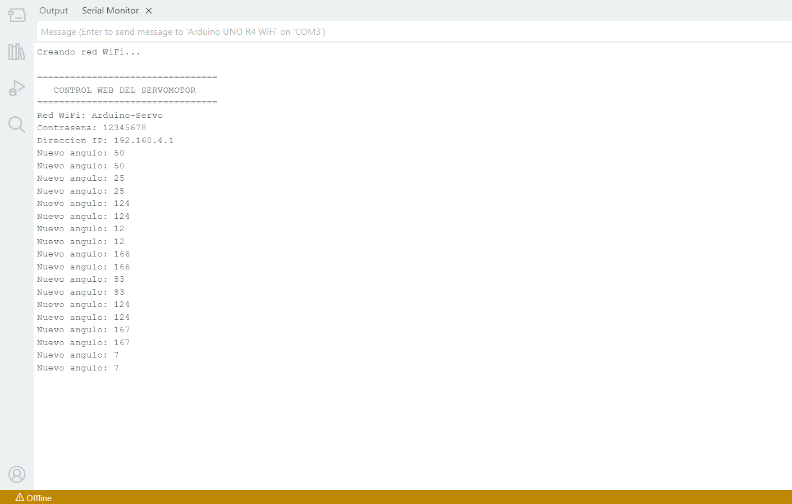
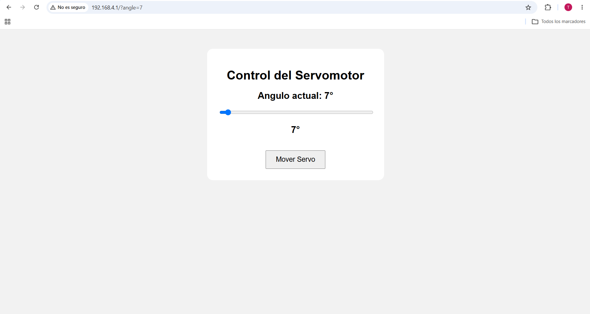
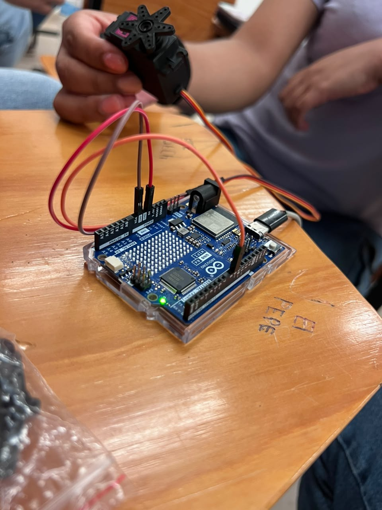

# Control de servomotor por interfaz web

Arduino UNO R4 WiFi · Servomotor MG996R · Servidor web en tiempo real

## Descripción

El proyecto permite posicionar un servomotor desde una página web. El Arduino UNO R4 WiFi crea su propia red WiFi y funciona como servidor web. Al abrir la página en el navegador y mover el control deslizante, el ángulo se envía al Arduino en tiempo real y el servo gira hasta esa posición. Así se puede controlar un actuador desde cualquier celular o computadora, sin instalar ninguna aplicación.

## Objetivos de aprendizaje

- Configurar el Arduino UNO R4 WiFi como punto de acceso (`WiFi.beginAP()`) y servidor HTTP (`WiFiServer`).
- Interpretar peticiones HTTP y responder con una página web o con datos en texto.
- Enviar datos desde el navegador sin recargar la página con `fetch()` de JavaScript.
- Generar la señal PWM de un servomotor con la librería `Servo`: 50 Hz, pulso de 544 µs (0°) a 2400 µs (180°).
- Validar datos de entrada (ángulo entre 0 y 180).
- Documentar un circuito en Fritzing.

## Material utilizado

- Arduino UNO R4 WiFi
- Servomotor MG996R
- Cables Dupont
- Cable USB
- Computadora o celular con navegador web

## Diagrama del circuito




Archivo editable de Fritzing: [diagrama_servo.fzz](Diagrama/diagrama_servo_R4WiFi.fzz)

> Fritzing no trae el R4 WiFi en su librería oficial, pero existe una pieza hecha por la comunidad (Peter Van Epp, del foro de Fritzing)

### Diagrama de bloques



## Código

- [servo_web.ino](Codigo/servo_web/servo_web.ino): versión final, comentada.
- [CSW.ino](Codigo/version_inicial/CSW.ino): versión inicial con la que se hicieron las primeras pruebas.

## Terminal



[Monitor_Serial](Terminal/monitor_serial.png): registro de la prueba con la versión inicial, donde se ve la red creada, la IP 192.168.4.1 y los ángulos recibidos (cada uno duplicado por el error descrito arriba).

## Interfaz web



Página funcionando después de enviar 7° (`192.168.4.1/?angle=7`).

## Video del funcionamiento

- [Readme](Video/Readme.txt)
- [Ver video en YouTube](https://youtu.be/AtDGY__b80o)

## Evidencias de armado

  

## Resultados

Incluye: [Resultados.pdf](Resultados/Resultados.pdf)

- Gráficas: [ángulo vs. ancho de pulso](Resultados/grafica_angulo_pulso.png), [secuencia de ángulos](Resultados/grafica_secuencia_angulos.png), [procesamientos por ángulo](Resultados/grafica_procesamientos.png)
- Tablas de datos: [datos_practica.csv](Resultados/datos_practica.csv)
- Observaciones sobre el comportamiento del sistema

| Ángulo enviado | 50° | 25° | 124° | 12° | 166° | 83° | 124° | 167° | 7° |
|---|---|---|---|---|---|---|---|---|---|
| Pulso (µs) | 1059 | 801 | 1822 | 667 | 2255 | 1399 | 1822 | 2265 | 616 |

El servo se posicionó en cada ángulo enviado desde la página, entre 7° y 167°, en ambos sentidos de giro.

## Conclusiones

La práctica permitió comprobar que el Arduino UNO R4 WiFi puede funcionar como punto de acceso y servidor web sin otra red ni aplicaciones, y que la librería `Servo` traduce cada ángulo en el ancho de pulso adecuado dentro de una señal de 50 Hz. Revisar el monitor serie ayudó a detectar un error que no se notaba en el movimiento del servo: el navegador hace peticiones adicionales, como la del ícono, y el servidor debe analizar solo la ruta de cada petición. Con esa corrección y el envío en tiempo real, el control es más fluido y confiable. También quedó claro que un servo de alto par como el MG996R debe alimentarse con una fuente externa y compartir tierra con el Arduino.

## Reporte

[Reporte_servomotor.pdf](Reporte/Reporte_servomotor.pdf)

Este documento contiene la introducción, los objetivos, el marco teórico, el desarrollo, las capturas de la web funcionando, el análisis de resultados y las conclusiones (general e individual).

- Reporte técnico estilo IEEE (PDF)
- Datos CSV
- Diagramas adicionales

## Estructura de carpetas

```
Servomotor/
├── README.md
├── Codigo/
│   ├── servo_web/servo_web.ino      ← versión final
│   └── version_inicial/CSW.ino
├── Diagrama/                        ← Fritzing (.fzz), protoboard, esquemático y bloques
├── Imagenes/                        ← fotos del armado
├── Terminal/                        ← captura del monitor serie
├── Web/                             ← captura de la interfaz web
├── Resultados/                      ← Resultados.pdf, gráficas y CSV
├── Reporte/                         ← Reporte.pdf
└── Video/                           ← enlace al video
```
