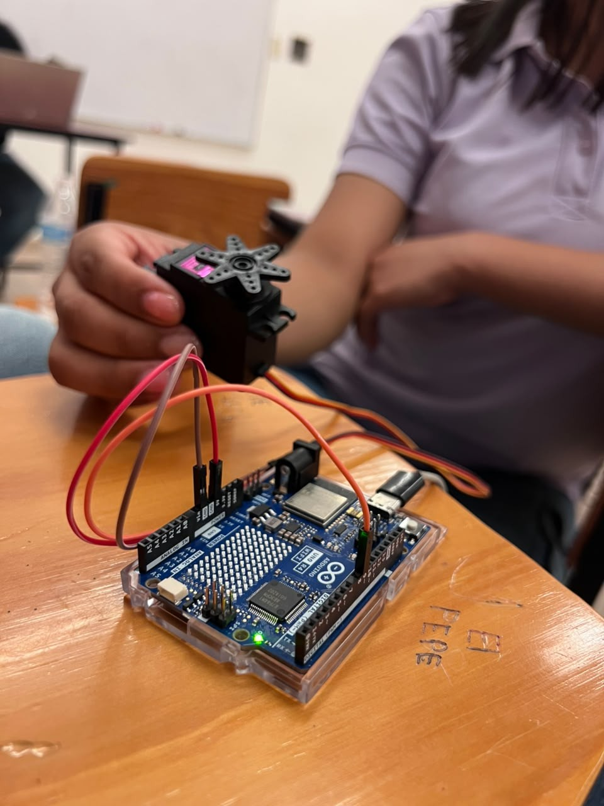
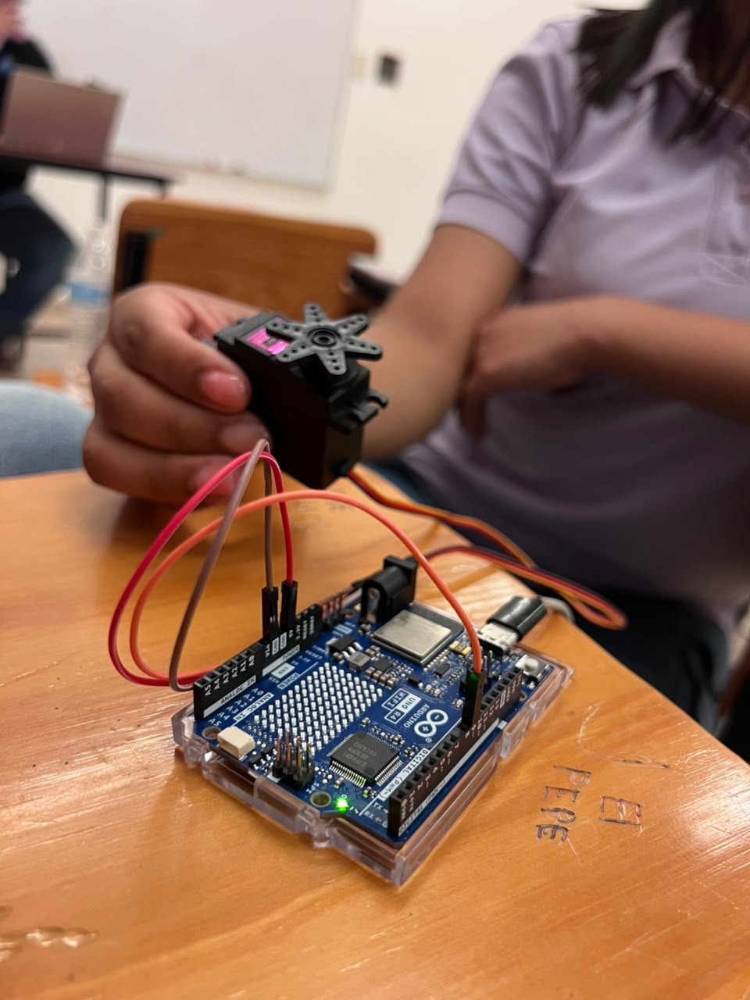

# Control de servomotor por interfaz web

Arduino UNO R4 WiFi · Servomotor MG996R · Servidor web en tiempo real

## Descripción

El proyecto permite posicionar un servomotor desde una página web. El Arduino UNO R4 WiFi crea su propia red WiFi y funciona como servidor web. Al abrir la página en el navegador y mover el control deslizante, el ángulo se envía al Arduino en tiempo real y el servo gira hasta esa posición. Así se puede controlar un actuador desde cualquier celular o computadora, sin instalar ninguna aplicación.

## Objetivos de aprendizaje

- Configurar el Arduino UNO R4 WiFi como punto de acceso (`WiFi.beginAP()`) y servidor HTTP (`WiFiServer`).
- Interpretar peticiones HTTP y responder con una página web o con datos en texto.
- Enviar datos desde el navegador sin recargar la página con `fetch()` de JavaScript.
- Generar la señal PWM de un servomotor con la librería `Servo`: 50 Hz, pulso de 544 µs (0°) a 2400 µs (180°).
- Validar datos de entrada (ángulo entre 0 y 180).
- Documentar un circuito en Fritzing.

## Material utilizado

- Arduino UNO R4 WiFi
- Servomotor MG996R
- Cables Dupont
- Cable USB
- Computadora o celular con navegador web

## Diagrama del circuito

Archivo editable de Fritzing: [diagrama_servo.fzz](Diagrama/diagrama_servo_R4WiFi.fzz)

> Fritzing no trae el R4 WiFi en su librería oficial, pero existe una pieza hecha por la comunidad (Peter Van Epp, del foro de Fritzing)
  

### Diagrama de bloques

## Código

El código configura el Arduino UNO R4 WiFi como servidor web y permite controlar el ángulo del servomotor MG996R mediante un deslizador. Utiliza peticiones HTTP y fetch() para enviar la posición en tiempo real, validando los ángulos de 0° a 180°.
- [servo_web.ino](Codigo/servo_web/servo_web.ino): versión final, comentada.
- [CSW.ino](Codigo/version_inicial/CSW.ino): versión inicial con la que se hicieron las primeras pruebas.

## Video del funcionamiento

En el video se muestra el funcionamiento del servomotor MG996R controlado desde una interfaz web, donde se ajusta su ángulo en tiempo real mediante un deslizador conectado al Arduino UNO R4 WiFi.
- [Readme](Video/Readme.txt)
- [Ver video en YouTube](https://youtu.be/AtDGY__b80o)

## Resultados

## Resultados

El sistema respondió correctamente a las peticiones enviadas desde el navegador: al mover el
control deslizante y presionar **"Mover Servo"**, el ángulo seleccionado se aplicó de inmediato
al eje del servomotor, confirmando el correcto funcionamiento del flujo
`petición GET → validación → PWM → respuesta`.

El servidor HTTP alojado en el Arduino UNO R4 WiFi validó correctamente el rango permitido
(**0°–180°**), rechazando los valores fuera de ese intervalo y protegiendo así el mecanismo del
servomotor. La señal PWM generada en el pin 9 a una frecuencia de **50 Hz** resultó adecuada
para el control del MG996R.

Todo el sistema —placa, red WiFi y servomotor— operó exclusivamente con la alimentación de 5 V
proporcionada por el puerto USB de la computadora, sin requerir una fuente externa, lo que
simplificó considerablemente el armado del circuito en comparación con prácticas que involucran
motores de mayor consumo.

## Reporte

Reporte formal con introducción, metodologia utilizada, capturas de la web funcionando, análisis de resultados y conclusiones individuales. 
[Reporte_servomotor.pdf](Reporte/Reporte_Servomotor_Web.pdf)

## Conclusiones

La práctica permitió comprobar que el Arduino UNO R4 WiFi puede funcionar como punto de acceso y servidor web sin otra red ni aplicaciones, y que la librería `Servo` traduce cada ángulo en el ancho de pulso adecuado dentro de una señal de 50 Hz. Revisar el monitor serie ayudó a detectar un error que no se notaba en el movimiento del servo: el navegador hace peticiones adicionales, como la del ícono, y el servidor debe analizar solo la ruta de cada petición. Con esa corrección y el envío en tiempo real, el control es más fluido y confiable. También quedó claro que un servo de alto par como el MG996R debe alimentarse con una fuente externa y compartir tierra con el Arduino.

